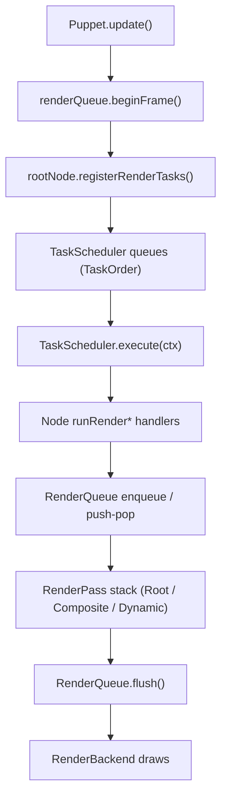
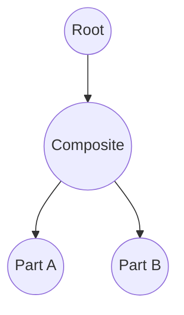
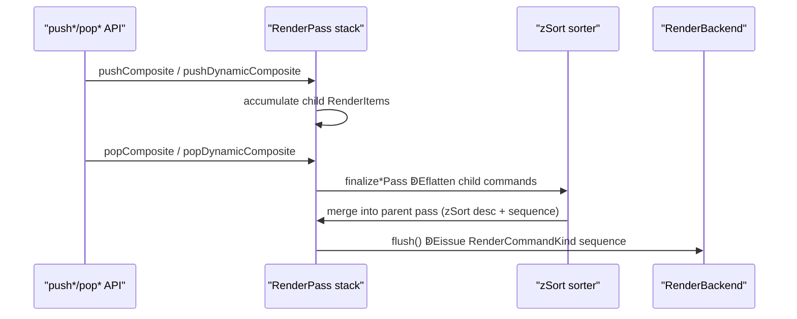
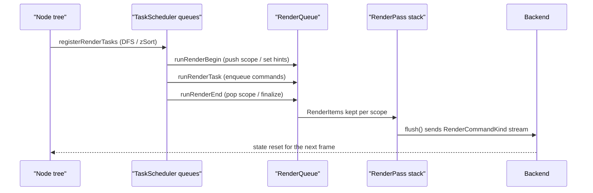

# Current Rendering Pipeline (TaskScheduler / RenderQueue)

This document captures the rendering pipeline that is already implemented in the repository as of 2025-03.  
Some parts of the feature set are still WIP, but the goal here is to record the behaviour that actually runs today
and to visualise how TaskScheduler, RenderQueue, and the Node tree interact.

---

## 1. High-Level Flow

- `Puppet.update()` drives a frame and registers the entire node tree into the TaskScheduler.
- The TaskScheduler executes a fixed `TaskOrder` sequence and, during render phases, accumulates GPU commands in the RenderQueue.
- RenderQueue keeps separate `RenderPass` entries for Root / Composite / DynamicComposite targets, then sorts commands
  by `zSort` (descending) and submission order before forwarding them to the backend.
- Composite / DynamicComposite nodes declare scopes via `push*/pop*`, confining child drawing into their own FBOs
  before blitting to the parent target. Masking and DynamicComposite re-render decisions are also resolved inside those scopes.

---

## 2. TaskScheduler

### 2.1 Data Structures

- Implementation: `source/nijilive/core/render/scheduler.d`
- `TaskScheduler` stores `Task[][TaskOrder] queues` and iterates the fixed
  `orderSequence = [Init, Parameters, PreProcess, Dynamic, Post0, Post1, Post2, RenderBegin, Render, RenderEnd, Final]`.
- A `Task` is `(TaskOrder order, TaskKind kind, TaskHandler handler)`.  
  `TaskHandler` is `void delegate(ref RenderContext)` and `RenderContext` embeds a `RenderQueue*`,
  a `RenderBackend`, and the `RenderGpuState`.

### 2.2 Node Registration Walk

- Every `Node` exposes `registerRenderTasks` and registers itself plus its children via DFS.
  - The child list is duplicated and **stable-sorted by `zSort` descending**, so tasks always register back-to-front.
  - Each node pushes one task per order from Init through Final. `Composite` / `DynamicComposite` override the
    render-phase entries to manage RenderQueue scopes.
  - Subtrees beneath a `DynamicComposite` ancestor may skip their own Render tasks (`allowRenderTasks=false`)
    because the parent DynamicComposite renders or reuses them offscreen.
- `Puppet.update()` orchestrates:
  1. `renderQueue.beginFrame()` and `renderScheduler.clearTasks()`
  2. Root node `registerRenderTasks`
  3. A `TaskOrder.Parameters` task that updates parameters / drivers  
     (transform dirtiness and automation updates live here)
  4. `renderScheduler.execute(renderContext)`

### 2.3 Execution Stages

1. **Init**  E`runBeginTask`: reset per-node state, offsets, caches.
2. **Parameters**  Epuppet-level task updates parameters and drivers.
3. **PreProcess / Dynamic / Post0-2**  Egeometry and state transitions.
4. **RenderBegin / Render / RenderEnd**  Ecomposites push/pop scopes; parts call `enqueueRenderCommands`.
5. **Final**  E`runFinalTask`: flush notifications and carry state into the next frame.

### 2.4 Example Order Produced by DFS

- `registerRenderTasks` adds `TaskOrder.Init..Final` in **pre-order (parent ↁEchildren)** and appends
  `TaskOrder.RenderEnd` only after all descendants finished, making RenderEnd a **post-order (children ↁEparent)** entry.
- Because children are `zSort`-sorted, the queues inherit the same back-to-front order.
- Nodes directly under a DynamicComposite skip their own `RenderBegin/Render/RenderEnd` when `allowRenderTasks=false`.

| TaskOrder                                                      | Parent/Child order | Notes |
|----------------------------------------------------------------|--------------------|-------|
| Init / PreProcess / Dynamic / Post0-2 / RenderBegin / Render / Final | Parent ↁEchild (pre-order) | Parent task goes first, followed by children sorted by `zSort` |
| RenderEnd                                                      | Child ↁEparent (post-order) | Registered after the parent finishes registering its children |

Example: Root ↁEComposite ↁEPartA/B (B has higher `zSort`):

- `TaskQueue[Render] = [Root, Composite, PartB, PartA]`
- `TaskQueue[RenderEnd] = [PartA, PartB, Composite, Root]`

This queue order is exactly how `TaskScheduler.execute` invokes the handlers, which in turn manipulate RenderQueue via `RenderContext`.

---

## 3. RenderQueue

### 3.1 Layered RenderPasses

- Implementation: `source/nijilive/core/render/queue.d`
- `RenderQueue` keeps a `passStack`; `RenderPassKind` is `Root / Composite / DynamicComposite`.
- Each pass stores `RenderItem[] items` with `(zSort, sequence, RenderCommandBuilder builder)`.  
  The builder is a closure that accepts a `RenderCommandEmitter` and issues the required calls.
  `sequence` increments monotonically per pass to maintain stability when `zSort` ties.
- `RenderScopeHint` chooses which pass receives an item. Nodes walk ancestors to find active
  Composite / DynamicComposite scopes. DynamicComposites that reuse cached textures return `skipHint`
  so their children do not enqueue new commands.

### 3.2 Enqueue and Sorting

- `enqueueItem(float zSort, RenderScopeHint hint, builder)` stores the delegate for later playback.
- `collectPassItems` sorts each pass by `zSort` descending then by `sequence` ascending and returns
  the ordered list of builders.

### 3.3 Composite Scopes

- `pushComposite(Composite comp, bool maskUsesStencil, MaskBinding[] maskBindings)` pushes a new pass;
  `popComposite(token, comp)` finalises it.
- `finalizeCompositePass`:
  1. Collect child builders.
  2. Wrap them with `beginComposite` / `endComposite` emitter calls.
  3. If masks exist, surround the final quad with `beginMask / applyMask* / beginMaskContent / endMask`.
  4. Emit `drawCompositeQuad` to the parent pass and notify the Composite that the scope closed.
- `parentPassIndexForComposite` climbs the node tree to find the parent Composite/DynamicComposite pass.

### 3.4 DynamicComposite Scopes

- `dynamicRenderBegin` decides whether the DynamicComposite needs a redraw. If yes:
  - call `pushDynamicComposite`
  - rewrite child parts Emodel matrices for the offscreen basis
  - enqueue each child (nested DynamicComposite may recurse)
- `dynamicRenderEnd`:
  - `popDynamicComposite(token, this, postCommands)` to emit `BeginDynamicComposite ↁEchild ↁEEndDynamicComposite`
  - `postCommands` typically draw the DynamicComposite as a Part, including masks
  - if no redraw happened, fall back to `enqueueRenderCommands`
- After closing, it resets `dynamicScopeActive` / `dynamicScopeToken` and updates cache flags (`textureInvalidated`, `deferred`, etc.).

### 3.5 flush and Backend Handoff

- `flush(RenderBackend backend, ref RenderGpuState state)` ensures only the Root pass remains, flattens its commands,
  and dispatches them via the backend’s API (`drawPartPacket`, `beginMask`, `beginComposite`, ...).
- After flush it calls `clear()` to drop all passes, ready for the next `beginFrame()`.

---

## 4. How TaskScheduler and RenderQueue Cooperate

### 4.1 Two Queues, One Flow

1. **Scheduling (TaskScheduler)**  
   - DFS over the node tree enqueues handlers into `TaskQueue[TaskOrder]`.  
     Only the execution order is decided at this point; no GPU commands exist yet.
2. **Execution ↁERenderQueue updates**  
   - `TaskScheduler.execute` walks each `TaskQueue`.  
     During Render phases the handlers call `push*/pop*` and `enqueueItem`, using the `RenderQueue*` provided via `RenderContext`.
   - RenderQueue accumulates `RenderPass` stacks and `RenderItem`s while keeping the original `zSort` ordering.
3. **RenderQueue flush ↁEBackend**  
   - Once every TaskOrder finished and only the Root pass remains, `flush()` emits the final `RenderCommandKind[]`
     to the backend, which performs the actual GPU work.

### 4.2 Step-by-Step Recap

1. **Tree Scan & Preparation**  E`scanParts` gathers drivers/parts; Composite / DynamicComposite prepare local ordering and offscreen transforms.
2. **TaskScheduler Enqueue**  E`registerRenderTasks` pushes handlers into queues (`RenderEnd` in post-order).
3. **TaskOrder Execution**  E`TaskScheduler.execute` runs `runBeginTask ↁE... ↁErunFinalTask`, computing `RenderScopeHint` for each renderable node.
4. **RenderQueue Stack Ops**  E`pushComposite/pushDynamicComposite` open scopes; `enqueueItem` appends commands to the active pass; `pop*` finalises and hands off to the parent pass.
5. **flush & GPU Calls**  E`renderQueue.flush()` flattens the Root pass and invokes the backend for actual drawing, then resets the queue for the following frame.

---

## 5. Design Guarantees Relied Upon by the Code

- **Scope integrity**  EEvery `push*` must pair with a `pop*`; flush enforces `passStack.length == 1`.
- **Consistent zSort**  EBoth task registration and RenderQueue sorting respect `zSort` descending, preserving DFS relationships while ensuring back-to-front rendering.
- **Localised masks**  E`MaskApplyPacket` usage is confined to Composite / DynamicComposite transfers so child rendering remains unaffected.
- **DynamicComposite cache discipline**  EFlags like `reuseCachedTextureThisFrame` / `textureInvalidated` avoid unnecessary redraws and scope churn.
- **Backend abstraction**  ERenderQueue only emits `RenderCommandKind` data; OpenGL-specific operations live entirely within the backend implementation.

These guarantees allow the current TaskScheduler and RenderQueue implementation to produce predictable, debuggable frame output.

---

## 6. RenderBackend and RenderGpuState

### 6.1 RenderBackend interface

- Defined in `source/nijilive/core/render/backends/package.d`.
- `RenderBackend` is the abstraction that converts the RenderQueue’s `RenderCommandKind` stream into actual GPU calls.
- Key method groups:

| Category | Representative methods | Purpose |
|----------|------------------------|---------|
| Initialization / viewport | `initializeRenderer`, `resizeViewportTargets`, `beginScene`, `endScene`, `postProcessScene` | Renderer setup and per-frame boundaries |
| Drawable / Part resources | `initializeDrawableResources`, `createDrawableBuffers`, `uploadDrawableIndices`, `uploadSharedVertexBuffer`, `uploadSharedUvBuffer`, `uploadSharedDeformBuffer`, `drawDrawableElements` | Mesh / vertex buffer allocation and updates |
| Blending / debug | `supportsAdvancedBlend`, `setAdvancedBlendEquation`, `issueBlendBarrier`, `initDebugRenderer`, `drawDebugLines` | Advanced blend equations and debug drawing |
| RenderQueue-derived drawing | `drawPartPacket`, `drawMaskPacket`, `beginComposite`, `drawCompositeQuad`, `endComposite`, `beginMask`, `applyMask`, `beginMaskContent`, `endMask` | Almost 1:1 mapping from RenderCommandKind |
| DynamicComposite | `beginDynamicComposite`, `endDynamicComposite`, `destroyDynamicComposite` | Offscreen FBO lifecycle for dynamic composites |
| Utility drawing | `drawTextureAtPart`, `drawTextureAtPosition`, `drawTextureAtRect` | Direct drawing helpers for UI/debug |
| Framebuffer / texture handles | `framebufferHandle`, `renderImageHandle`, `compositeFramebufferHandle`, ... | Allow external tooling/post-processors to access GPU resources |
| Difference aggregation | `setDifferenceAggregationEnabled`, `evaluateDifferenceAggregation`, `fetchDifferenceAggregationResult` | Automated visual-diff tooling |

From the RenderQueue’s perspective, **flush simply calls these methods in sequence**, leaving the OpenGL (or other API) specifics to the backend implementation.

### 6.2 RenderGpuState

- Struct: `RenderGpuState { uint framebuffer; uint[8] drawBuffers; ubyte drawBufferCount; bool[4] colorMask; bool blendEnabled; }`
- Role:
  - Cache the currently bound framebuffer, draw buffers, color mask, and blend state inside the backend.
  - `RenderQueue.flush()` resets it via `state = RenderGpuState.init;`; the backend updates the fields as it switches GPU resources.
  - Serves as a shared, API-agnostic state block so future backends (OpenGL, Vulkan, etc.) can reuse the same interface.

With this addition, the documentation now covers the RenderQueue ↁERenderBackend handoff and the shared state management that underpins it.

---

## 7. Frame-to-Frame Reuse Layer (2025-11 addendum)

The runtime now has a reuse layer that keeps TaskScheduler/RenderQueue behaviour exactly as documented above, while avoiding per-frame rebuilds when no nodes changed. This section only appends details; nothing earlier is removed or summarised.

### 7.1 Change Tracking (`NotifyReason`)

- Every `Node.notifyChange` also calls `puppet.recordNodeChange(reason)`.
- `Puppet` tracks two booleans per frame:  
  - `structureDirty` ↁEtriggered by `NotifyReason.StructureChanged` or forced rebuilds  
  - `attributeDirty` ↁEtriggered by `AttributeChanged`, `Transformed`, `Initialized`
- `consumeFrameChanges()` returns the accumulated flags and clears them for the next frame.

### 7.2 TaskScheduler Cache

- Task queues are rebuilt only when `forceFullRebuild` or `structureDirty` is set.  
  `rebuildRenderTasks()` clears queues, runs `rootNode.registerRenderTasks`, and injects the puppet-level `TaskOrder.Parameters` delegate that wraps `updateParametersAndDrivers`.
- Otherwise the previous queue contents remain valid and no DFS walk is performed.

### 7.3 Execution Order Preservation

- Even if we plan to reuse the render commands, each frame still runs `TaskOrder.Init` and `TaskOrder.Parameters` by calling `renderScheduler.executeRange(ctx, TaskOrder.Init, TaskOrder.Parameters)`.  
  This guarantees that deformable nodes reset their stacks (`runBeginTask`) before parameters and drivers push new deformations, exactly as before.
- If executing these stages introduces a structural change (for example, a driver toggles masks), the scheduler immediately rebuilds and reruns the Init+Parameters range before proceeding.

### 7.4 RenderGraph / RenderQueue Execution

- `renderGraph.beginFrame()` now occurs every update; nodes always enqueue their builders for the current frame.
- No cached command buffer exists. The emitter consumes builders immediately during `renderGraph.playback(commandEmitter)`.
- If Init+Parameters introduce structural changes the scheduler rebuilds and reruns just as before; afterwards, `TaskOrder.PreProcess … Final` executes every frame to keep dynamic content up to date.

### 7.5 Per-Frame Summary

1. (Optional) Rebuild TaskScheduler queues when structure changed.  
2. Always run Init + Parameters stages (deformation reset + parameter updates).  
3. Rebuild again if those stages introduced new structural edits.  
4. Run the remaining TaskOrders and rebuild RenderGraph.  
5. Invoke `renderGraph.playback(commandEmitter)` during `Puppet.draw()`, letting the backend-specific emitter translate node references into GPU work.

---

## 8. Struct-of-Arrays Geometry Atlases (Vec*Array + shared buffers)

Earlier versions uploaded a separate VBO per Part/Deformable whenever vertices, UVs, or deformation deltas changed. The current implementation replaces that per-object upload storm with three shared atlases backed by the `Vec*Array` Struct-of-Arrays storage. This section documents how the system works in practice.

### 8.1 Vec*Array Recap

- `nijilive.math.veca` defines `Vec2Array`, `Vec3Array`, and `Vec4Array` as fixed-lane Struct-of-Arrays buffers.  
  Internally they store contiguous “lanes E(`lane(0)`, `lane(1)`, …) for each component, which makes SIMD-friendly bulk copies possible.
- Each `Vec*Array` instance can `bindExternalStorage(storage, offset, length)`, meaning multiple logical arrays can share slices of one backing buffer without additional allocations.
- Geometry-heavy nodes (e.g. `Drawable`/`Deformable`) keep their vertex, UV, and deformation data in `Vec2Array` fields, so these can be re-bound to shared storage without changing higher-level code.

### 8.2 SharedVecAtlas and Registration

- `nijilive.core.render.shared_deform_buffer` defines three atlases (`deformAtlas`, `vertexAtlas`, `uvAtlas`).  
  Each atlas tracks a list of `Vec2Array*` bindings plus the pointer to the GPU packet field that needs the final offset.
- Lifecycle:
  1. `Drawable` constructors call `sharedDeformRegister`, `sharedVertexRegister`, and `sharedUvRegister`, passing each local `Vec2Array` and a pointer to `deformSliceOffset` / `vertexSliceOffset` / `uvSliceOffset`.
  2. The atlas rebuilds a single contiguous storage block sized to the sum of all registered lengths, copies existing data into the new layout (SoA lane copy), and calls `bindExternalStorage` so every node’s array views the shared memory.
  3. Whenever vertices/UVs/deforms change length, `shared*Resize` triggers another rebuild. Destructors invoke `shared*Unregister` to remove the entry.
- The atlas emits:
  - `shared*BufferData()` ↁEthe packed `Vec2Array` storage for the backend.
  - `shared*AtlasStride()` ↁEtotal element count (used during packet construction).
  - Dirty flags (`shared*BufferDirty`, `shared*MarkDirty`, `shared*MarkUploaded`) to gate GPU uploads.

### 8.3 PartDrawPacket Offsets

- `PartDrawPacket` contains `vertexOffset`, `vertexAtlasStride`, `uvOffset`, `uvAtlasStride`, `deformOffset`, and `deformAtlasStride`.  
  These fields point into the shared atlases instead of per-part buffers.
- During packet construction each Drawable uses the offsets that the atlas wrote into `vertexSliceOffset` / `uvSliceOffset` / `deformSliceOffset`.  
  As long as the atlas does not rebuild, those offsets remain valid and no per-frame pointer fix-up is necessary.

### 8.4 RenderQueue.beginFrame Upload Path

- At the start of `RenderQueue.beginFrame`, the emitter checks `sharedVertexBufferDirty`, `sharedUvBufferDirty`, and `sharedDeformBufferDirty`.  
  For each dirty atlas, it retrieves the packed `Vec2Array`, calls the backend’s `uploadShared*Buffer` functions once, and then marks the atlas as uploaded.
- Backend implementations (e.g. `opengl/drawable_buffers.d`) own a single GL buffer per attribute:
  - Created lazily via `glGenBuffers`.
  - Updated with `glUploadFloatVecArray(sharedBuffer, atlasData, GL_DYNAMIC_DRAW, "Upload*")`, which understands the SoA layout.
- Because every drawable references offsets inside the same buffer, the backend binds these shared VBOs exactly once per flush instead of per drawable.

### 8.5 Dirty Tracking Integration

- Whenever a drawable mutates its `Vec2Array` (e.g. `Deformable.updateVertices`, welding, physics), it calls `shared*MarkDirty`.  
  The atlas does not need to rebuild unless the length changes, so most edits are in-place writes to the shared memory.
- Even though commands are rebuilt every frame, the atlas dirty flags still prevent redundant uploads, so the backend gets GPU-side reuse.

This atlas-based Struct-of-Arrays design is what enables the “single glBindBuffer/glBufferData per frame Ebehaviour discussed during the refactor, and should be kept in sync with any future changes to Vec*Array or the emitter packet builders.

---

## 9. Frame-to-Frame Reuse Layer (detailed breakdown)

> **Status:** Implemented in branch `refactor/rendering-soa2` (2025-11).  
> **Goal:** keep the DFS/TaskScheduler/RenderQueue flow intact while avoiding per-frame allocations when no node changed.

All sections above still describe the exact order in which tasks and RenderQueue scopes execute. The reuse layer simply decides **when we have to rebuild those structures**.

### 9.1 Change Tracking Basics

- Every `Node.notifyChange` now notifies the owning `Puppet` before bubbling up, passing through the original `NotifyReason`.
- The puppet records two booleans per frame: `structureDirty` (tree mutations, mask list edits, etc.) and `attributeDirty`
  (parameter edits, driver output, transforms). `NotifyReason.StructureChanged` flips both bits; every other reason flips `attributeDirty`.
- `Puppet.update()` calls `consumeFrameChanges()` to read and clear the flags.  
  A pending `forceFullRebuild` (e.g. after loading a puppet) also sets both bits.

### 9.2 TaskScheduler Cache

- On the first frame, or whenever `structureDirty` is seen, `rebuildRenderTasks()`:
  1. Clears TaskScheduler queues.
  2. Runs the usual `rootNode.registerRenderTasks`.
  3. Injects the puppet-level `TaskOrder.Parameters` entry that wraps `updateParametersAndDrivers`.
- When no structural change happened, the previously built queues stay intact and no DFS walk is needed.

### 9.3 Guaranteed Init + Parameter Stage

- Regardless of cache state, each frame runs `renderScheduler.executeRange(ctx, TaskOrder.Init, TaskOrder.Parameters)` once.
- This preserves the original behaviour where `runBeginTask` (deformation stack reset, filter state reset, notification deferral) always runs **before**
  parameters and drivers push new values into deform stacks.
- Because this stage runs unconditionally, deformation parameters work the same even when the later render stages are skipped.

### 9.4 Render Phases and Emitters

- Every frame executes the remaining TaskOrders and rebuilds the pass stack after Init + Parameters.
- `renderGraph.playback(commandEmitter)` immediately replays the builders when `Puppet.draw()` runs; no cached buffer is stored.
- OpenGL uses the `RenderQueue` emitter, which builds the `PartDrawPacket`/`MaskApplyPacket` data on demand and calls the actual backend.

### 9.5 Rebuild Loop

Putting everything together:

1. **Maybe rebuild tasks**  Eif `forceFullRebuild` or `structureDirty`, re-register the node tree.
2. **Always run Init + Parameters**  Eensures deformation stacks see the injected parameter values.
3. **Consume change flags**  Eif a new structure change surfaced during step 2 (e.g. drivers toggled masks), rebuild again.
4. **Execute render stages**  Erun the remaining TaskOrders, let GraphBuilder capture builders, and hand them to the emitter during draw.

This layer lets the renderer skip redundant allocations and GL buffer uploads on the many frames where user input/automation leaves the node tree unchanged, without compromising the deterministic ordering and scope rules described earlier in this document.
