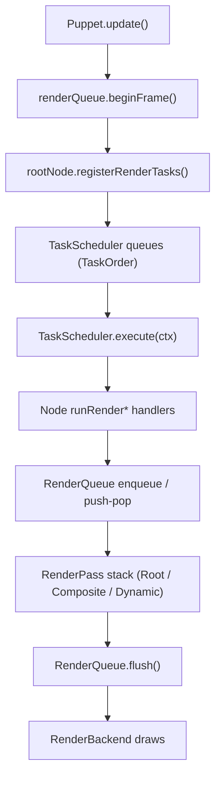
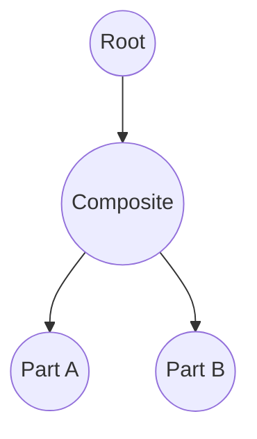
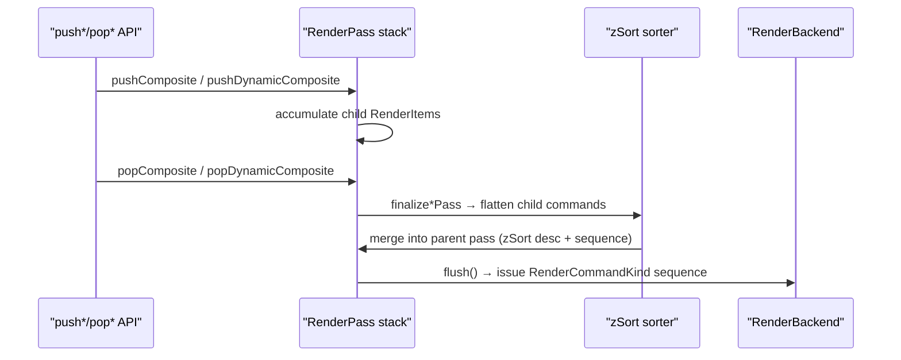
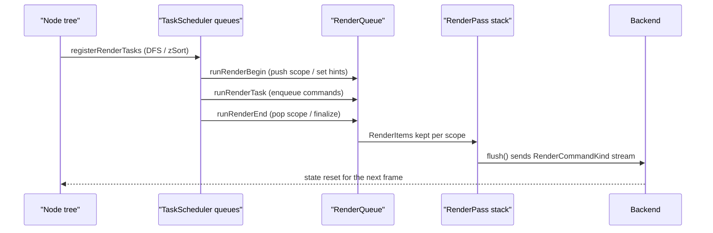

# Current Rendering Pipeline (TaskScheduler / RenderQueue)

This document captures the rendering pipeline that is already implemented in the repository as of 2025-03.  
Some parts of the feature set are still WIP, but the goal here is to record the behaviour that actually runs today
and to visualise how TaskScheduler, RenderQueue, and the Node tree interact.

---

## 1. High-Level Flow

- `Puppet.update()` drives a frame and registers the entire node tree into the TaskScheduler.
- The TaskScheduler executes a fixed `TaskOrder` sequence and, during render phases, accumulates GPU commands in the RenderQueue.
- RenderQueue keeps separate `RenderPass` entries for Root / Composite / DynamicComposite targets, then sorts commands
  by `zSort` (descending) and submission order before forwarding them to the backend.
- Composite / DynamicComposite nodes declare scopes via `push*/pop*`, confining child drawing into their own FBOs
  before blitting to the parent target. Masking and DynamicComposite re-render decisions are also resolved inside those scopes.

---

## 2. TaskScheduler

### 2.1 Data Structures

- Implementation: `source/nijilive/core/render/scheduler.d`
- `TaskScheduler` stores `Task[][TaskOrder] queues` and iterates the fixed
  `orderSequence = [Init, Parameters, PreProcess, Dynamic, Post0, Post1, Post2, RenderBegin, Render, RenderEnd, Final]`.
- A `Task` is `(TaskOrder order, TaskKind kind, TaskHandler handler)`.  
  `TaskHandler` is `void delegate(ref RenderContext)` and `RenderContext` embeds a `RenderQueue*`,
  a `RenderBackend`, and the `RenderGpuState`.

### 2.2 Node Registration Walk

- Every `Node` exposes `registerRenderTasks` and registers itself plus its children via DFS.
  - The child list is duplicated and **stable-sorted by `zSort` descending**, so tasks always register back-to-front.
  - Each node pushes one task per order from Init through Final. `Composite` / `DynamicComposite` override the
    render-phase entries to manage RenderQueue scopes.
  - Subtrees beneath a `DynamicComposite` ancestor may skip their own Render tasks (`allowRenderTasks=false`)
    because the parent DynamicComposite renders or reuses them offscreen.
- `Puppet.update()` orchestrates:
  1. `renderQueue.beginFrame()` and `renderScheduler.clearTasks()`
  2. Root node `registerRenderTasks`
  3. A `TaskOrder.Parameters` task that updates parameters / drivers  
     (transform dirtiness and automation updates live here)
  4. `renderScheduler.execute(renderContext)`

### 2.3 Execution Stages

1. **Init** — `runBeginTask`: reset per-node state, offsets, caches.
2. **Parameters** — puppet-level task updates parameters and drivers.
3. **PreProcess / Dynamic / Post0-2** — geometry and state transitions.
4. **RenderBegin / Render / RenderEnd** — composites push/pop scopes; parts call `enqueueRenderCommands`.
5. **Final** — `runFinalTask`: flush notifications and carry state into the next frame.

### 2.4 Example Order Produced by DFS

- `registerRenderTasks` adds `TaskOrder.Init..Final` in **pre-order (parent → children)** and appends
  `TaskOrder.RenderEnd` only after all descendants finished, making RenderEnd a **post-order (children → parent)** entry.
- Because children are `zSort`-sorted, the queues inherit the same back-to-front order.
- Nodes directly under a DynamicComposite skip their own `RenderBegin/Render/RenderEnd` when `allowRenderTasks=false`.

| TaskOrder                                                      | Parent/Child order | Notes |
|----------------------------------------------------------------|--------------------|-------|
| Init / PreProcess / Dynamic / Post0-2 / RenderBegin / Render / Final | Parent → child (pre-order) | Parent task goes first, followed by children sorted by `zSort` |
| RenderEnd                                                      | Child → parent (post-order) | Registered after the parent finishes registering its children |

Example: Root → Composite → PartA/B (B has higher `zSort`):

- `TaskQueue[Render] = [Root, Composite, PartB, PartA]`
- `TaskQueue[RenderEnd] = [PartA, PartB, Composite, Root]`

This queue order is exactly how `TaskScheduler.execute` invokes the handlers, which in turn manipulate RenderQueue via `RenderContext`.

---

## 3. RenderQueue

### 3.1 Layered RenderPasses

- Implementation: `source/nijilive/core/render/queue.d`
- `RenderQueue` keeps a `passStack`; `RenderPassKind` is `Root / Composite / DynamicComposite`.
- Each pass stores `RenderItem[] items` with `(zSort, sequence, RenderCommandData[] commands)`.  
  `sequence` increments monotonically per pass to maintain stability when `zSort` ties.
- `RenderScopeHint` chooses which pass receives an item. Nodes walk ancestors to find active
  Composite / DynamicComposite scopes. DynamicComposites that reuse cached textures return `skipHint`
  so their children do not enqueue new commands.

### 3.2 Enqueue and Sorting

- `enqueueItem(float zSort, RenderScopeHint hint, builder)` lets the caller fill a `RenderCommandBuffer`;
  the resulting `RenderItem` is appended to the target pass.
- `collectPassCommands` sorts each pass by `zSort` descending then by `sequence` ascending,
  and flattens the commands into a linear array.

### 3.3 Composite Scopes

- `pushComposite(Composite comp, bool maskUsesStencil, MaskApplyPacket[] maskPackets)` pushes a new pass;
  `popComposite(token, comp)` finalises it.
- `finalizeCompositePass`:
  1. Collect child commands.
  2. Wrap them with `BeginComposite → child commands → EndComposite`.
  3. If masks exist, surround the final quad with `BeginMask / ApplyMask* / BeginMaskContent / EndMask`.
  4. Enqueue `DrawCompositeQuad` to the parent pass and notify the Composite that the scope closed.
- `parentPassIndexForComposite` climbs the node tree to find the parent Composite/DynamicComposite pass.

### 3.4 DynamicComposite Scopes

- `dynamicRenderBegin` decides whether the DynamicComposite needs a redraw. If yes:
  - call `pushDynamicComposite`
  - rewrite child parts’ model matrices for the offscreen basis
  - enqueue each child (nested DynamicComposite may recurse)
- `dynamicRenderEnd`:
  - `popDynamicComposite(token, this, postCommands)` to emit `BeginDynamicComposite → child → EndDynamicComposite`
  - `postCommands` typically draw the DynamicComposite as a Part, including masks
  - if no redraw happened, fall back to `enqueueRenderCommands`
- After closing, it resets `dynamicScopeActive` / `dynamicScopeToken` and updates cache flags (`textureInvalidated`, `deferred`, etc.).

### 3.5 flush and Backend Handoff

- `flush(RenderBackend backend, ref RenderGpuState state)` ensures only the Root pass remains, flattens its commands,
  and dispatches them via the backend’s API (`drawPartPacket`, `beginMask`, `beginComposite`, ...).
- After flush it calls `clear()` to drop all passes, ready for the next `beginFrame()`.

---

## 4. How TaskScheduler and RenderQueue Cooperate

### 4.1 Two Queues, One Flow

1. **Scheduling (TaskScheduler)**  
   - DFS over the node tree enqueues handlers into `TaskQueue[TaskOrder]`.  
     Only the execution order is decided at this point; no GPU commands exist yet.
2. **Execution → RenderQueue updates**  
   - `TaskScheduler.execute` walks each `TaskQueue`.  
     During Render phases the handlers call `push*/pop*` and `enqueueItem`, using the `RenderQueue*` provided via `RenderContext`.
   - RenderQueue accumulates `RenderPass` stacks and `RenderItem`s while keeping the original `zSort` ordering.
3. **RenderQueue flush → Backend**  
   - Once every TaskOrder finished and only the Root pass remains, `flush()` emits the final `RenderCommandKind[]`
     to the backend, which performs the actual GPU work.

### 4.2 Step-by-Step Recap

1. **Tree Scan & Preparation** — `scanParts` gathers drivers/parts; Composite / DynamicComposite prepare local ordering and offscreen transforms.
2. **TaskScheduler Enqueue** — `registerRenderTasks` pushes handlers into queues (`RenderEnd` in post-order).
3. **TaskOrder Execution** — `TaskScheduler.execute` runs `runBeginTask → ... → runFinalTask`, computing `RenderScopeHint` for each renderable node.
4. **RenderQueue Stack Ops** — `pushComposite/pushDynamicComposite` open scopes; `enqueueItem` appends commands to the active pass; `pop*` finalises and hands off to the parent pass.
5. **flush & GPU Calls** — `renderQueue.flush()` flattens the Root pass and invokes the backend for actual drawing, then resets the queue for the following frame.

---

## 5. Design Guarantees Relied Upon by the Code

- **Scope integrity** — Every `push*` must pair with a `pop*`; flush enforces `passStack.length == 1`.
- **Consistent zSort** — Both task registration and RenderQueue sorting respect `zSort` descending, preserving DFS relationships while ensuring back-to-front rendering.
- **Localised masks** — `MaskApplyPacket` usage is confined to Composite / DynamicComposite transfers so child rendering remains unaffected.
- **DynamicComposite cache discipline** — Flags like `reuseCachedTextureThisFrame` / `textureInvalidated` avoid unnecessary redraws and scope churn.
- **Backend abstraction** — RenderQueue only emits `RenderCommandKind` data; OpenGL-specific operations live entirely within the backend implementation.

These guarantees allow the current TaskScheduler and RenderQueue implementation to produce predictable, debuggable frame output.

---

## 6. RenderBackend and RenderGpuState

### 6.1 RenderBackend interface

- Defined in `source/nijilive/core/render/backends/package.d`.
- `RenderBackend` is the abstraction that converts the RenderQueue’s `RenderCommandKind` stream into actual GPU calls.
- Key method groups:

| Category | Representative methods | Purpose |
|----------|------------------------|---------|
| Initialization / viewport | `initializeRenderer`, `resizeViewportTargets`, `beginScene`, `endScene`, `postProcessScene` | Renderer setup and per-frame boundaries |
| Drawable / Part resources | `initializeDrawableResources`, `createDrawableBuffers`, `uploadDrawableIndices`, `uploadSharedVertexBuffer`, `uploadSharedUvBuffer`, `uploadSharedDeformBuffer`, `drawDrawableElements` | Mesh / vertex buffer allocation and updates |
| Blending / debug | `supportsAdvancedBlend`, `setAdvancedBlendEquation`, `issueBlendBarrier`, `initDebugRenderer`, `drawDebugLines` | Advanced blend equations and debug drawing |
| RenderQueue-derived drawing | `drawPartPacket`, `drawMaskPacket`, `beginComposite`, `drawCompositeQuad`, `endComposite`, `beginMask`, `applyMask`, `beginMaskContent`, `endMask` | Almost 1:1 mapping from RenderCommandKind |
| DynamicComposite | `beginDynamicComposite`, `endDynamicComposite`, `destroyDynamicComposite` | Offscreen FBO lifecycle for dynamic composites |
| Utility drawing | `drawTextureAtPart`, `drawTextureAtPosition`, `drawTextureAtRect` | Direct drawing helpers for UI/debug |
| Framebuffer / texture handles | `framebufferHandle`, `renderImageHandle`, `compositeFramebufferHandle`, ... | Allow external tooling/post-processors to access GPU resources |
| Difference aggregation | `setDifferenceAggregationEnabled`, `evaluateDifferenceAggregation`, `fetchDifferenceAggregationResult` | Automated visual-diff tooling |

From the RenderQueue’s perspective, **flush simply calls these methods in sequence**, leaving the OpenGL (or other API) specifics to the backend implementation.

### 6.2 RenderGpuState

- Struct: `RenderGpuState { uint framebuffer; uint[8] drawBuffers; ubyte drawBufferCount; bool[4] colorMask; bool blendEnabled; }`
- Role:
  - Cache the currently bound framebuffer, draw buffers, color mask, and blend state inside the backend.
  - `RenderQueue.flush()` resets it via `state = RenderGpuState.init;`; the backend updates the fields as it switches GPU resources.
  - Serves as a shared, API-agnostic state block so future backends (OpenGL, Vulkan, etc.) can reuse the same interface.

With this addition, the documentation now covers the RenderQueue → RenderBackend handoff and the shared state management that underpins it.
