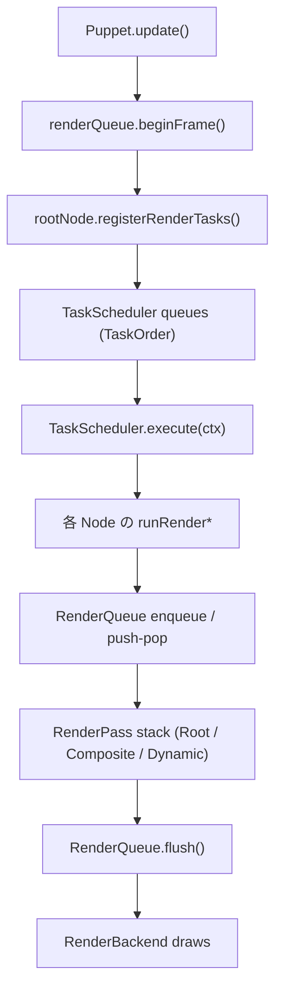
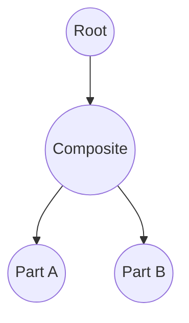
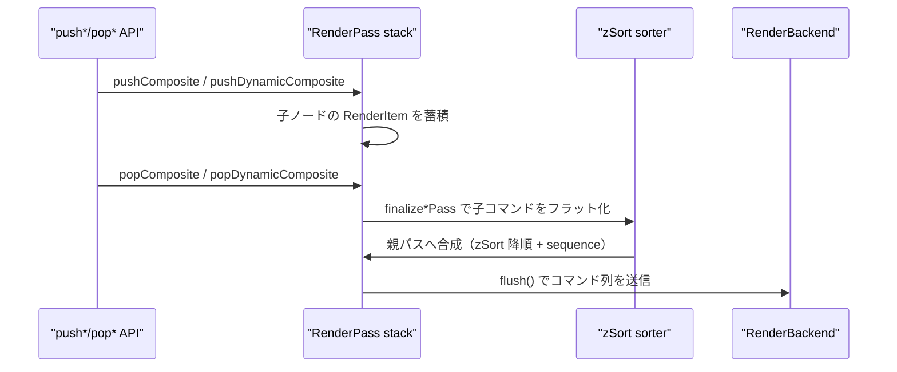
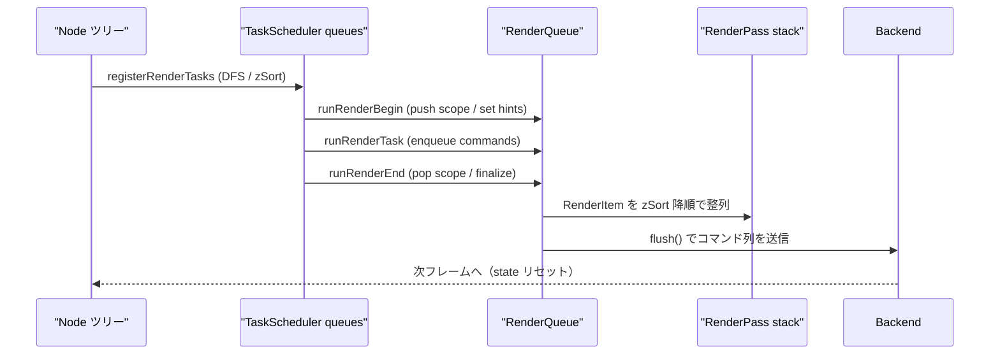

# 新レンダリングパイプライン現行仕様（TaskScheduler / RenderQueue）

本ドキュメントは 2025-03 時点でリポジトリに実装済みの描画パイプラインを整理する。  
一部まだ WIP の挙動はあるが、ここでは「現状こう動いている」という事実ベースの情報をまとめ、
TaskScheduler・RenderQueue・Node ツリーの関連を可視化する。

---

## 1. 全体像

- `Puppet.update()` が 1 フレームを駆動し、TaskScheduler に Node ツリー全体の処理を登録。
- TaskScheduler は `TaskOrder` の固定シーケンスで各タスクを実行し、RenderQueue へ GPU コマンドを積む。
- RenderQueue は Root / Composite / DynamicComposite ごとに `RenderPass` を積み上げ、  
  同じターゲットへ出力するコマンドを `zSort` 降順 + 受付順で安定ソートしてから Backend へ渡す。
- Composite / DynamicComposite は `push*/pop*` でスコープを宣言し、子ノードの描画結果を
  自身の FBO に閉じ込めた後で親ターゲットへ転送する。マスクや DynamicComposite の再描画判定もここで完結する。

---

## 2. TaskScheduler

### 2.1 データ構造

- 実装: `source/nijilive/core/render/scheduler.d`
- `TaskScheduler` は `Task[][TaskOrder] queues` を保持し、  
  `orderSequence = [Init, Parameters, PreProcess, Dynamic, Post0, Post1, Post2, RenderBegin, Render, RenderEnd, Final]`
  の固定順でループする。
- `Task` は `(TaskOrder order, TaskKind kind, TaskHandler handler)` のタプルで、`TaskHandler` は
  `void delegate(ref RenderContext)`。`RenderContext` には `RenderQueue* renderQueue` と
  `RenderBackend renderBackend`, `RenderGpuState gpuState` が入る。

### 2.2 ノード登録フロー

- 各 `Node` は `registerRenderTasks` を持ち、自身と子ノードのタスクを DFS で登録する。
  - 子ノード一覧は複製後に **`zSort` 降順で stable sort** され、TaskOrder に関わらず奥→手前で登録される。
  - 各 Node はデフォルトで Init～Final までのタスクを 1 つずつ積む。`Composite` や `DynamicComposite` は
    スコープ管理のために RenderBegin/Render/RenderEnd の登録方法を上書きする。
  - `DynamicComposite` が祖先に存在するサブツリーはオフスクリーン再利用のため、
    自身の Render フェーズをスキップし、親 DynamicComposite から委譲されたタスクのみを持つ。
- `Puppet.update()` は
  1. `renderQueue.beginFrame()` と `renderScheduler.clearTasks()`
  2. ルート Node の `registerRenderTasks`
  3. `TaskOrder.Parameters` にパラメータ／ Driver 更新をまとめたタスクを追加\
     （Transform dirty フラグや自動運転の更新はここで行われる）
  4. `renderScheduler.execute(renderContext)`
  という手順で 1 フレームを確定させる。

### 2.3 実行時のステップ

1. **Init**: `runBeginTask` で Node のステートを初期化し、オフセットやキャッシュをリセット。
2. **Parameters**: Puppet 側で一括登録したタスクがパラメータ／ドライバを更新。
3. **PreProcess / Dynamic / Post0-2**: 各 Node が幾何計算やステート遷移を実施。
4. **RenderBegin / Render / RenderEnd**: Composite / DynamicComposite はここで RenderQueue の push/pop を呼び、
   Part は `enqueueRenderCommands` 経由で Draw コマンドを追加する。
5. **Final**: `runFinalTask` で通知フラグ等を後処理し、次フレームへ状態を持ち越す。

### 2.4 DFS に沿った登録順の具体例

- `registerRenderTasks` は **親 → 子** の順に `TaskOrder.Init～Final` までを追加し、最後に `TaskOrder.RenderEnd` を追加する。  
  このため `RenderEnd` だけが **子 → 親**（ポストオーダー）になる。
- 子リストは `zSort` 降順でソート済みなので、TaskQueue 内の順番も奥→手前で安定する。
- `DynamicComposite` 直下のノードは `allowRenderTasks=false` の場合、`RenderBegin/Render/RenderEnd` を自分では登録しない。

| TaskOrder          | 親子順 | 備考 |
|--------------------|--------|------|
| Init / PreProcess / Dynamic / Post0-2 / RenderBegin / Render / Final | 親→子（プリオーダー） | 親のタスクが先に並び、続けて zSort 降順の子タスクが登録される |
| RenderEnd          | 子→親（ポストオーダー） | 親は自分と子の `registerRenderTasks` が終わった後に登録する |

例として Root → Composite → PartA/B のツリーを考えると、キュー内の並びは以下になる。

- `TaskQueue[Render] = [Root, Composite, PartB, PartA]` （Composite が子を zSort 降順＝B→Aで登録）
- `TaskQueue[RenderEnd] = [PartA, PartB, Composite, Root]` （子の RenderEnd が先に来る）

この順序がそのまま `TaskScheduler.execute` のループで消化され、各タスクが `RenderContext` を介して RenderQueue に作用する。

---

## 3. RenderQueue

### 3.1 レイヤー別 RenderPass

- 実装: `source/nijilive/core/render/queue.d`
- `RenderQueue` は `passStack` を保持し、`RenderPassKind` は `Root / Composite / DynamicComposite`。
- 各 pass には `RenderItem[] items`（`zSort`, `sequence`, `RenderCommandData[] commands`）が蓄積される。  
  `sequence` は pass 内で単調増加し、`zSort` が同じ場合に安定順序を保証する。
- `RenderScopeHint` は enqueue 先の pass を決めるヒント。Node は祖先を遡ってアクティブな
  Composite / DynamicComposite を探し、該当 pass があればその参照を使う。DynamicComposite が
  キャッシュを再利用する場合は `skipHint` を返して描画をスキップする。

### 3.2 コマンド投入とソート

- `enqueueItem(float zSort, RenderScopeHint hint, builder)` が呼ばれると、`builder` が
  `RenderCommandBuffer` にコマンドを詰め、その配列を hint 先の pass に `RenderItem` として追加する。
- `collectPassCommands` は各 pass の `items` を `zSort` 降順 → `sequence` 昇順でソートし、
  フラットな `RenderCommandData[]` に展開する。

### 3.3 Composite スコープ

- `pushComposite(Composite comp, bool maskUsesStencil, MaskApplyPacket[] maskPackets)`
  が新しい pass をスタックに積み、`popComposite(token, comp)` が対応する pass を終了させる。
- `finalizeCompositePass` の処理:
  1. 子パスのコマンドを収集。
  2. `BeginComposite → 子コマンド → EndComposite` でラップ。
  3. マスクが指定されていれば `BeginMask / ApplyMask* / BeginMaskContent` を挿入し、
     Composite のクワッド描画を囲う。
  4. 親 pass に `DrawCompositeQuad` を enqueue し、Composite 側へ scope close を通知。
- 親 pass の決定には `parentPassIndexForComposite` を用いて Node ツリー上の親 Composite / DynamicComposite を探索する。

### 3.4 DynamicComposite スコープ

- `DynamicComposite` は `dynamicRenderBegin` で再描画が必要かを判定し、必要な場合のみ
  `pushDynamicComposite` → 子 Part を offscreen matrix に差し替えて enqueue する。
- `dynamicRenderEnd` では
  - `popDynamicComposite(token, this, postCommands)` を呼び、`BeginDynamicComposite` ～ `EndDynamicComposite` を親 pass に差し込む。
  - `postCommands` でマスク処理や Part としての最終描画を追加する（`makeDrawPartCommand` など）。
  - 再描画しなかった場合は既存テクスチャを使った `enqueueRenderCommands` のみを Root pass に積む。
- スコープを閉じた後は `dynamicScopeActive` や `dynamicScopeToken` をリセットし、
  再描画済みであればテクスチャの invalidate フラグや deferred カウンタを更新する。

### 3.5 flush と Backend 連携

- `flush(RenderBackend backend, ref RenderGpuState state)` は
  1. `passStack.length == 1`（Root のみ）を enforce し、push/pop の不整合を検出。
  2. Root pass の `RenderItem` を平坦化。
  3. `RenderCommandKind` ごとに backend の API (`drawPartPacket`, `beginMask`, `beginComposite`, など) を呼び出す。
- flush 後は `clear()` → Root pass 再生成し、次フレームの `beginFrame` まで状態を持たない。

---

## 4. TaskScheduler と RenderQueue の連携

### 4.1 2 段階キューの関係

1. **タスク登録（TaskScheduler）**  
   - Node ツリーを DFS して `TaskQueue[Order]` にタスクを push。順序は §2.4 の通り。  
   - この段階では GPU コマンドはまだ生成されず、「どのタイミングでどの Node の処理を走らせるか」という予定表だけができる。
2. **タスク実行 → RenderQueue 更新**  
   - `TaskScheduler.execute` が各 `TaskQueue` を消化。`RenderContext` 内の `renderQueue` へのポインタを通じて
     `runRenderBegin/RunRender/RunRenderEnd` が呼ばれ、必要に応じて `push*/pop*` / `enqueueItem` を実行する。
   - RenderQueue 側では `passStack` にレンダーターゲットごとの `RenderPass` が積まれ、ノードの `zSort` を保ったまま
     `RenderItem` が蓄積される。
3. **RenderQueue flush → Backend**  
   - 全 TaskOrder が終わり、`passStack` が Root のみになったら `flush()` を呼ぶ。  
   - `RenderCommandKind[]` が Backend へ渡り、FBO 切替やマスク適用を含む実 GPU 呼び出しが実行される。

このように「TaskScheduler（ロジック順）」→「RenderQueue（描画命令）」→「Backend（GPU）」という 3 段階を順に通過する。

### 4.2 ステップ分解

1. **ツリー探索と準備**  
   `scanParts` がドライバ・Part を収集し、Composite / DynamicComposite は子 Part のローカル並び替えや
   offscreen 変換行列を準備する。
2. **TaskScheduler への投入**  
   `registerRenderTasks` が `zSort` 降順でタスクを登録。`RenderEnd` だけがポストオーダーになるため、
   Composite の pop 処理が確実に子の後に実行される。
3. **TaskOrder ごとの実行**  
   `TaskScheduler.execute` が orderSequence を回り、`runBeginTask → ... → runFinalTask` が呼ばれる。
   Render フェーズでは `RenderScopeHint` を計算し、該当スコープの RenderPass にコマンドを追加する。
4. **RenderQueue のスタック処理**  
   `pushComposite/pushDynamicComposite` が passStack にスコープを積み、子ノードの `enqueueItem`
   はそのスコープに `RenderItem` を増やす。`pop*` で `finalize*Pass` が走り、子コマンドが親 pass に転送される。
5. **flush と GPU 呼び出し**  
   `RenderQueue.flush()` が Root pass の `RenderItem` をフラット化し、Backend に対して
   `RenderCommandKind` の順で呼び出す。完了後 `clear()` して次フレームの `beginFrame()` に備える。

---

## 5. 設計指針（現行コードが依存している前提）

- **スコープ整合性の担保**: すべての `push*` は必ず `pop*` とペアで呼ばれ、
  flush 前に `passStack.length == 1` であることを enforce している。
- **zSort の一貫性**: Task 登録時と RenderQueue 内部の両方で `zSort` 降順を徹底し、
  DFS の親子関係を壊さずに「奥→手前」の描画順を維持する。
- **マスクの局所化**: `MaskApplyPacket` の適用は Composite / DynamicComposite の転送時に限定し、
  子ノードの描画内容へ直接干渉しない。
- **DynamicComposite の再描画最小化**: `reuseCachedTextureThisFrame` / `textureInvalidated`
  などのフラグでオフスクリーン再描画を抑制し、不要な push/pop や DrawCommand を避ける。
- **Backend への依存最小化**: RenderQueue からは `RenderCommandKind` の列だけを渡し、
  OpenGL など具体的な実装詳細は Backend に閉じ込める。

以上により、現行実装の TaskScheduler と RenderQueue の挙動を俯瞰できるようになった。

---

## 6. RenderBackend と RenderGpuState

### 6.1 RenderBackend インターフェース

- 定義場所: `source/nijilive/core/render/backends/package.d`
- `RenderBackend` は RenderQueue から渡される `RenderCommandKind` を最終的な GPU 呼び出しへ変換する抽象層。
- 主なメソッド群:

| 分類 | 代表メソッド | 説明 |
|------|--------------|------|
| 初期化 / ビューポート | `initializeRenderer`, `resizeViewportTargets`, `beginScene`, `endScene`, `postProcessScene` | レンダラのセットアップとフレーム境界処理 |
| Drawable/Part リソース | `initializeDrawableResources`, `createDrawableBuffers`, `uploadDrawableIndices`, `uploadSharedVertexBuffer`, `uploadSharedUvBuffer`, `uploadSharedDeformBuffer`, `drawDrawableElements` | メッシュや頂点バッファの生成・更新 |
| ブレンド / デバッグ | `supportsAdvancedBlend`, `setAdvancedBlendEquation`, `issueBlendBarrier`, `initDebugRenderer`, `drawDebugLines` | 高度なブレンドモードやデバッグ描画制御 |
| RenderQueue 由来の描画 | `drawPartPacket`, `drawMaskPacket`, `beginComposite`, `drawCompositeQuad`, `endComposite`, `beginMask`, `applyMask`, `beginMaskContent`, `endMask` | RenderCommandKind と 1:1 に近いメソッド群 |
| DynamicComposite | `beginDynamicComposite`, `endDynamicComposite`, `destroyDynamicComposite` | 動的オフスクリーン用 FBO 管理 |
| 補助描画 | `drawTextureAtPart`, `drawTextureAtPosition`, `drawTextureAtRect` | UI やデバッグ向けの直接描画 API |
| フレームバッファ・テクスチャ取得 | `framebufferHandle`, `renderImageHandle`, `compositeFramebufferHandle`, ... | 外部ツールやポストプロセスが現在の GPU リソースを参照するためのハンドル群 |
| 差分計測 | `setDifferenceAggregationEnabled`, `evaluateDifferenceAggregation`, `fetchDifferenceAggregationResult` | DifferenceAggregation を用いた自動テスト/検証向け機能 |

- RenderQueue から見ると **flush 時にこれらのメソッドを順番に呼ぶだけ**であり、OpenGL など具体的な実装は Backend 側が担う。

### 6.2 RenderGpuState

- 構造体: `RenderGpuState { uint framebuffer; uint[8] drawBuffers; ubyte drawBufferCount; bool[4] colorMask; bool blendEnabled; }`
- 役割:
  - Backend が現在バインドしている FBO やカラーマスク、ブレンド状態をキャッシュする。
  - `RenderQueue.flush()` 開始時に `state = RenderGpuState.init;` としてクリアし、Backend が必要に応じて上書きする。
  - 将来的に複数 Backend 実装（OpenGL / Vulkan 等）が共通インターフェースで状態を共有できるようにするための足場。

これにより、ドキュメント上でも RenderQueue → RenderBackend の役割分担と、状態管理の流れを追うことができる。

---

## 7. フレーム間再利用レイヤー（2025-11 追記）

> **Status:** ブランチ `refactor/rendering-soa2` にて実装済み。  
> **目的:** TaskScheduler / RenderQueue の処理順や DFS の特性を維持したまま、同一内容のフレームで不要な再構築やメモリアロケーションを省くこと。

ここまでのセクションで説明したタスク登録／RenderQueue スコープの流れは従来通りである。再利用レイヤーは「どのフレームでそれを実行する必要があるか」を決めているに過ぎない。

### 7.1 NotifyReason による変化トラッキング

- すべての `Node.notifyChange` は親へ伝搬する前に必ず所属する `Puppet` を呼び出し、`NotifyReason` を記録させる。
- Puppet 側では 1 フレームにつき 2 つのフラグを持つ:
  - `structureDirty`: ツリー構造やマスク構成が変わった場合、または `forceFullRebuild` が指定された場合に立つ。
  - `attributeDirty`: パラメータ値・ドライバ出力・Transform など属性の変化で立つ（`StructureChanged` でも同時に立つ）。
- `Puppet.update()` はフレーム冒頭で `consumeFrameChanges()` を呼び、フラグを読み出してからリセットする。

### 7.2 TaskScheduler キャッシュ

- 初回フレーム、または `structureDirty` が立っているフレームだけ `rebuildRenderTasks()` を実行する。
  1. TaskScheduler の全キューをクリア。
  2. `rootNode.registerRenderTasks` を従来と同じ手順で呼ぶ。
  3. Puppet 側で `TaskOrder.Parameters` に `updateParametersAndDrivers` を呼ぶデリゲートを差し込む。
- 構造が変わっていない場合は TaskScheduler を再登録せず、前フレームのキュー内容をそのまま再利用できる。

### 7.3 Init + Parameters ステージの常時実行

- フレームを再構築するかどうかに関わらず、毎フレーム `renderScheduler.executeRange(ctx, TaskOrder.Init, TaskOrder.Parameters)` を 1 回実行する。
- これにより `runBeginTask`（変形スタックやフィルタ状態のリセット）が必ずパラメータ更新より先に走る。従来の「Init → Parameters → …」順序を崩さずに再利用を行える。
- このステージの実行中に構造変化が発生した場合は即座に `structureDirty` が立つため、後段で再登録される。

### 7.4 RenderGraph / RenderQueue のコマンド再利用

- `renderGraph.takeCommands()` で得た Root pass の `RenderCommandData[]` を `cachedCommands` として保持し、`cachedCommandsValid` が true の間は再利用を許す。
- Init+Parameters 後に `structureDirty` も `attributeDirty` も立っていなければ、`TaskOrder.PreProcess` 以降の実行をスキップし、`renderQueue.setCommands(cachedCommands, false)` で前回のコマンド列を流用する。
- いずれかのフラグが立っている場合は通常どおり残りの TaskOrder を実行し、`renderGraph.beginFrame()` → `takeCommands()` の結果を新しい `cachedCommands` として保存する。

### 7.5 1 フレームの処理フロー（再利用時）

1. `forceFullRebuild` または `structureDirty` なら TaskScheduler を再登録。
2. 必ず Init + Parameters 順で実行（変形スタックをリセット → パラメータ／ドライバを適用）。
3. この時点で構造変化が検出されたらもう一度 1 に戻って再登録。
4. Attribute も Structure も変化していなければ render フェーズをスキップし、キャッシュ済みコマンドを RenderQueue に積んでフラッシュする。
5. 変化があれば render フェーズを実行し、新しいコマンド列をキャッシュする。

---

## 8. Struct-of-Arrays ベースの共有ジオメトリアトラス

以前は Part / Deformable ごとに個別の VBO をアップロードしていたが、現在は `Vec*Array` を利用した共有アトラスへ移行し、1 フレームにつき頂点／UV／変形バッファをそれぞれ 1 回だけアップロードしている。

### 8.1 Vec*Array の概要

- `nijilive.math.veca` で定義される `Vec2Array` / `Vec3Array` / `Vec4Array` は成分ごとに連続したレーンを持つ Struct-of-Arrays 形式のバッファ。
- `lane(0)`, `lane(1)` などで各成分へのポインタを取得でき、高速なバルクコピーや SIMD 最適化がしやすい。
- `bindExternalStorage(storage, offset, length)` により、既存の `Vec*Array` を別の連続メモリ（共有アトラス）へ再バインドできる。

### 8.2 SharedVecAtlas と登録処理

- `nijilive.core.render.shared_deform_buffer` には `deformAtlas`, `vertexAtlas`, `uvAtlas` の 3 つの `SharedVecAtlas` がある。
- それぞれが `Vec2Array*` とドローコマンド用のオフセット書き込み先を記録し、以下のライフサイクルで動作する:
  1. `Drawable` のコンストラクタで `sharedDeformRegister` / `sharedVertexRegister` / `sharedUvRegister` を呼び、各 `Vec2Array` とオフセット格納先ポインタを渡す。
  2. アトラスは登録済み配列の合計長を計算し、必要なサイズの新しい `Vec2Array` を確保して lane 単位でコピーする。
  3. 各ノードの `Vec2Array` には `bindExternalStorage` で共有メモリを再バインドし、描画パケットに書き込むスライスオフセットも更新する。
- 配列長が変わった場合は `shared*Resize` が再配置をトリガーし、破棄時には `shared*Unregister` で登録解除する。

### 8.3 PartDrawPacket への反映

- `RenderCommandData.partPacket` には `vertexOffset`, `vertexAtlasStride`, `uvOffset`, `uvAtlasStride`, `deformOffset`, `deformAtlasStride` が含まれ、共有アトラス内の位置を示す。
- Drawable はアトラスが書き戻した `vertexSliceOffset` などの値をそのままパケットに設定するだけでよく、アトラスが再構築されない限り再計算は不要。

### 8.4 RenderQueue.flush でのアップロード

- `RenderQueue.flush` 冒頭で `sharedVertexBufferDirty()` などを確認し、dirty なアトラスだけをまとめてアップロードする。
- Backend (OpenGL 実装など) は属性ごとに 1 つの GL バッファを持ち、`glUploadFloatVecArray(sharedBuffer, atlasData, ...)` を 1 回呼ぶだけで全 Drawable の頂点や UV を更新できる。
- 共有アトラスなので flush 中にバインドや `glBufferData` を繰り返す必要がなく、`DrawPartPacket` ごとに VBO を切り替えるコストが消える。

### 8.5 ダーティフラグとの連携

- Drawable が `Vec2Array` の内容を直接書き換えた場合（物理シミュレーション、ウェルド、メッシュ編集など）は `shared*MarkDirty()` を呼ぶだけでよい。長さが変わらない限りアトラスの再配置は不要。
- セクション 7 のフレーム再利用と組み合わせると、ジオメトリも GPU コマンドも変化がないフレームでは一切のアップロードを行わないで済む。

---

## 9. フレーム間再利用レイヤー（詳細版）

高レベルの考え方は §7 にまとめたが、実装上の細部をもう少し噛み砕いて整理しておく。

### 9.1 変化検出の基本

- `Node.notifyChange` → `Puppet.recordNodeChange(reason)` の順で呼ばれ、`structureDirty` / `attributeDirty` の 2 ビットに分類される。
- `StructureChanged` は両方のビットを立て、それ以外（`AttributeChanged`, `Transformed`, `Initialized`）は `attributeDirty` のみを立てる。
- `consumeFrameChanges()` がフラグを読み出してクリアする唯一の場所で、以降の処理はこの返り値だけを見て再利用可否を判断する。

### 9.2 TaskScheduler の再利用条件

- `forceFullRebuild` / `structureDirty` / `schedulerCacheValid == false` のいずれかの場合のみ `rebuildRenderTasks()` を実行する。
- 再登録後は `schedulerCacheValid = true` となり、構造が変わらない限り次のフレームもそのまま使われる。

### 9.3 Init + Parameters の強制実行

- `renderScheduler.executeRange(ctx, TaskOrder.Init, TaskOrder.Parameters)` をフレームごとに必ず呼び、`runBeginTask` と `updateParametersAndDrivers` をセットで動かす。
- ここで構造変更が起きた場合は `structureDirty` が再び立つため、続く処理で即座に再登録が走る。

### 9.4 Render フェーズとコマンドキャッシュ

- `cachedCommandsValid` が true で、かつ `attributeDirty` も `structureDirty` も false の場合は Render フェーズ（PreProcess 以降）をスキップする。
- どちらかのフラグが true なら Render フェーズを通常通り実行し、`renderGraph.beginFrame()` → `takeCommands()` で新しい `cachedCommands` を作成する。

### 9.5 リビルドループ

1. 構造変化を確認し、必要なら TaskScheduler を再登録。
2. Init + Parameters を実行して変形スタックとパラメータを同期。
3. ここで構造変化が起きたら 1 に戻る。
4. 最終的な `FrameChangeState` を基に Render フェーズを実行するかどうか判断し、必要ならコマンド列を更新。
5. `cachedCommandsValid` が true なら RenderQueue にセットし、そうでなければ `clear()` する。

この詳細版を参照すれば、変更検知 → スケジューラ再利用 → RenderGraph 再利用の流れを実装レベルで追える。
