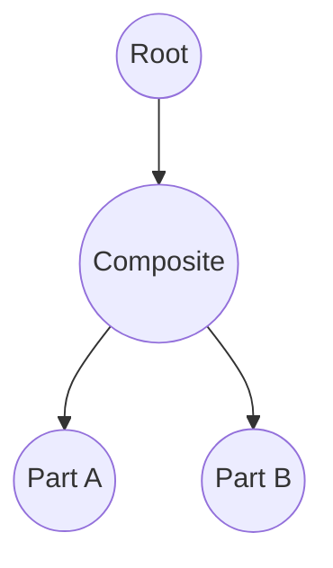
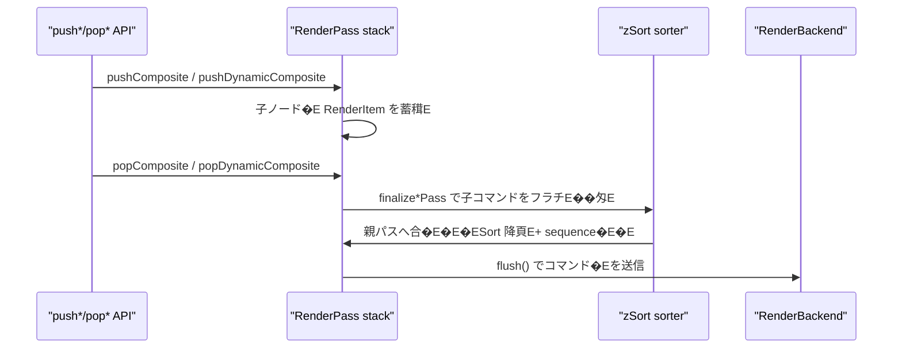
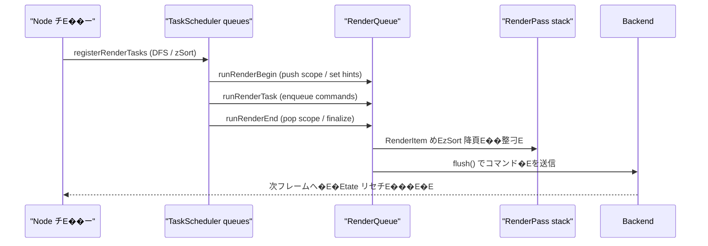

# 新レンダリングパイプライン現行仕様！EaskScheduler / RenderQueue�E�E

本ドキュメント�E 2025-03 時点でリポジトリに実裁E��みの描画パイプラインを整琁E��る、E 
一部まだ WIP の挙動はあるが、ここでは「現状こう動いてぁE��」とぁE��事実�Eースの惁E��をまとめ、E
TaskScheduler・RenderQueue・Node チE��ーの関連を可視化する、E

---

## 1. 全体像

- `Puppet.update()` ぁE1 フレームを駁E��し、TaskScheduler に Node チE��ー全体�E処琁E��登録、E
- TaskScheduler は `TaskOrder` の固定シーケンスで吁E��スクを実行し、RenderQueue へ GPU コマンドを積�E、E
- RenderQueue は Root / Composite / DynamicComposite ごとに `RenderPass` を積み上げ、E 
  同じターゲチE��へ出力するコマンドを `zSort` 降頁E+ 受付頁E��安定ソートしてから Backend へ渡す、E
- Composite / DynamicComposite は `push*/pop*` でスコープを宣言し、子ノード�E描画結果めE
  自身の FBO に閉じ込めた後で親ターゲチE��へ転送する。�EスクめEDynamicComposite の再描画判定もここで完結する、E

---

## 2. TaskScheduler

### 2.1 チE�Eタ構造

- 実裁E `source/nijilive/core/render/scheduler.d`
- `TaskScheduler` は `Task[][TaskOrder] queues` を保持し、E 
  `orderSequence = [Init, Parameters, PreProcess, Dynamic, Post0, Post1, Post2, RenderBegin, Render, RenderEnd, Final]`
  の固定頁E��ループする、E
- `Task` は `(TaskOrder order, TaskKind kind, TaskHandler handler)` のタプルで、`TaskHandler` は
  `void delegate(ref RenderContext)`。`RenderContext` には `RenderQueue* renderQueue` と
  `RenderBackend renderBackend`, `RenderGpuState gpuState` が�Eる、E

### 2.2 ノ�Eド登録フロー

- 吁E`Node` は `registerRenderTasks` を持ち、�E身と子ノード�EタスクめEDFS で登録する、E
  - 子ノード一覧は褁E��後に **`zSort` 降頁E�� stable sort** され、TaskOrder に関わらず奥→手前で登録される、E
  - 吁ENode はチE��ォルトで Init�E�Final までのタスクめE1 つずつ積�E。`Composite` めE`DynamicComposite` は
    スコープ管琁E�Eために RenderBegin/Render/RenderEnd の登録方法を上書きする、E
  - `DynamicComposite` が祖�Eに存在するサブツリーはオフスクリーン再利用のため、E
    自身の Render フェーズをスキチE�Eし、親 DynamicComposite から委譲されたタスクのみを持つ、E
- `Puppet.update()` は
  1. `renderQueue.beginFrame()` と `renderScheduler.clearTasks()`
  2. ルーチENode の `registerRenderTasks`
  3. `TaskOrder.Parameters` にパラメータ�E�EDriver 更新をまとめたタスクを追加\
     �E�Eransform dirty フラグめE�E動運転の更新はここで行われる�E�E
  4. `renderScheduler.execute(renderContext)`
  とぁE��手頁E�� 1 フレームを確定させる、E

### 2.3 実行時のスチE��チE

1. **Init**: `runBeginTask` で Node のスチE�Eトを初期化し、オフセチE��めE��ャチE��ュをリセチE��、E
2. **Parameters**: Puppet 側で一括登録したタスクがパラメータ�E�ドライバを更新、E
3. **PreProcess / Dynamic / Post0-2**: 吁ENode が幾何計算やスチE�Eト�E移を実施、E
4. **RenderBegin / Render / RenderEnd**: Composite / DynamicComposite はここで RenderQueue の push/pop を呼び、E
   Part は `enqueueRenderCommands` 経由で Draw コマンドを追加する、E
5. **Final**: `runFinalTask` で通知フラグ等を後�E琁E��、次フレームへ状態を持ち越す、E

### 2.4 DFS に沿った登録頁E�E具体侁E

- `registerRenderTasks` は **親 ↁE孁E* の頁E�� `TaskOrder.Init�E�Final` までを追加し、最後に `TaskOrder.RenderEnd` を追加する、E 
  こ�Eため `RenderEnd` だけが **孁EↁE親**�E��Eストオーダー�E�になる、E
- 子リスト�E `zSort` 降頁E��ソート済みなので、TaskQueue 冁E�E頁E��も奥→手前で安定する、E
- `DynamicComposite` 直下�Eノ�Eド�E `allowRenderTasks=false` の場合、`RenderBegin/Render/RenderEnd` を�E刁E��は登録しなぁE��E

| TaskOrder          | 親子頁E| 備老E|
|--------------------|--------|------|
| Init / PreProcess / Dynamic / Post0-2 / RenderBegin / Render / Final | 親→子（�Eリオーダー�E�E| 親のタスクが�Eに並び、続けて zSort 降頁E�E子タスクが登録されめE|
| RenderEnd          | 子�E親�E��Eストオーダー�E�E| 親は自刁E��子�E `registerRenderTasks` が終わった後に登録する |

例として Root ↁEComposite ↁEPartA/B のチE��ーを老E��ると、キュー冁E�E並びは以下になる、E

- `TaskQueue[Render] = [Root, Composite, PartB, PartA]` �E�Eomposite が子を zSort 降頁E��B→Aで登録�E�E
- `TaskQueue[RenderEnd] = [PartA, PartB, Composite, Root]` �E�子�E RenderEnd が�Eに来る！E

こ�E頁E��がそ�Eまま `TaskScheduler.execute` のループで消化され、各タスクぁE`RenderContext` を介して RenderQueue に作用する、E

---

## 3. RenderQueue

### 3.1 レイヤー別 RenderPass

- 実裁E `source/nijilive/core/render/queue.d`
- `RenderQueue` は `passStack` を保持し、`RenderPassKind` は `Root / Composite / DynamicComposite`、E
- 吁Epass には `RenderItem[] items`�E�EzSort`, `sequence`, `RenderCommandData[] commands`�E�が蓁E��される、E 
  `sequence` は pass 冁E��単調増加し、`zSort` が同じ場合に安定頁E��を保証する、E
- `RenderScopeHint` は enqueue 先�E pass を決めるヒント、Eode は祖�Eを遡ってアクチE��ブな
  Composite / DynamicComposite を探し、該彁Epass があれ�Eそ�E参�Eを使ぁE��EynamicComposite ぁE
  キャチE��ュを�E利用する場合�E `skipHint` を返して描画をスキチE�Eする、E

### 3.2 コマンド投入とソーチE

- `enqueueItem(float zSort, RenderScopeHint hint, builder)` が呼ばれると、`builder` ぁE
  `RenderCommandBuffer` にコマンドを詰め、その配�EめEhint 先�E pass に `RenderItem` として追加する、E
- `collectPassCommands` は吁Epass の `items` めE`zSort` 降頁EↁE`sequence` 昁E��E��ソートし、E
  フラチE��な `RenderCommandData[]` に展開する、E

### 3.3 Composite スコーチE

- `pushComposite(Composite comp, bool maskUsesStencil, MaskApplyPacket[] maskPackets)`
  が新しい pass をスタチE��に積み、`popComposite(token, comp)` が対応すめEpass を終亁E��せる、E
- `finalizeCompositePass` の処琁E
  1. 子パスのコマンドを収集、E
  2. `BeginComposite ↁE子コマンチEↁEEndComposite` でラチE�E、E
  3. マスクが指定されてぁE��ば `BeginMask / ApplyMask* / BeginMaskContent` を挿入し、E
     Composite のクワチE��描画を囲ぁE��E
  4. 親 pass に `DrawCompositeQuad` めEenqueue し、Composite 側へ scope close を通知、E
- 親 pass の決定には `parentPassIndexForComposite` を用ぁE�� Node チE��ー上�E親 Composite / DynamicComposite を探索する、E

### 3.4 DynamicComposite スコーチE

- `DynamicComposite` は `dynamicRenderBegin` で再描画が忁E��かを判定し、忁E��な場合�Eみ
  `pushDynamicComposite` ↁE孁EPart めEoffscreen matrix に差し替えて enqueue する、E
- `dynamicRenderEnd` では
  - `popDynamicComposite(token, this, postCommands)` を呼び、`BeginDynamicComposite` �E�E`EndDynamicComposite` を親 pass に差し込む、E
  - `postCommands` でマスク処琁E�� Part としての最終描画を追加する�E�EmakeDrawPartCommand` など�E�、E
  - 再描画しなかった場合�E既存テクスチャを使っぁE`enqueueRenderCommands` のみめERoot pass に積�E、E
- スコープを閉じた後�E `dynamicScopeActive` めE`dynamicScopeToken` をリセチE��し、E
  再描画済みであればチE��スチャの invalidate フラグめEdeferred カウンタを更新する、E

### 3.5 flush と Backend 連携

- `flush(RenderBackend backend, ref RenderGpuState state)` は
  1. `passStack.length == 1`�E�Eoot のみ�E�を enforce し、push/pop の不整合を検�E、E
  2. Root pass の `RenderItem` を平坦化、E
  3. `RenderCommandKind` ごとに backend の API (`drawPartPacket`, `beginMask`, `beginComposite`, など) を呼び出す、E
- flush 後�E `clear()` ↁERoot pass 再生成し、次フレームの `beginFrame` まで状態を持たなぁE��E

---

## 4. TaskScheduler と RenderQueue の連携

### 4.1 2 段階キューの関俁E

1. **タスク登録�E�EaskScheduler�E�E*  
   - Node チE��ーめEDFS して `TaskQueue[Order]` にタスクめEpush。頁E���E §2.4 の通り、E 
   - こ�E段階では GPU コマンド�Eまだ生�Eされず、「どのタイミングでどの Node の処琁E��走らせるか」とぁE��予定表だけができる、E
2. **タスク実衁EↁERenderQueue 更新**  
   - `TaskScheduler.execute` が各 `TaskQueue` を消化。`RenderContext` 冁E�E `renderQueue` へのポインタを通じて
     `runRenderBegin/RunRender/RunRenderEnd` が呼ばれ、忁E��に応じて `push*/pop*` / `enqueueItem` を実行する、E
   - RenderQueue 側では `passStack` にレンダーターゲチE��ごとの `RenderPass` が積まれ、ノード�E `zSort` を保ったまま
     `RenderItem` が蓄積される、E
3. **RenderQueue flush ↁEBackend**  
   - 全 TaskOrder が終わり、`passStack` ぁERoot のみになったら `flush()` を呼ぶ、E 
   - `RenderCommandKind[]` ぁEBackend へ渡り、FBO 刁E��めE�Eスク適用を含む宁EGPU 呼び出しが実行される、E

こ�Eように「TaskScheduler�E�ロジチE��頁E��」�E「RenderQueue�E�描画命令�E�」�E「Backend�E�EPU�E�」とぁE�� 3 段階を頁E��通過する、E

### 4.2 スチE��プ�E解

1. **チE��ー探索と準備**  
   `scanParts` がドライバ�EPart を収雁E��、Composite / DynamicComposite は孁EPart のローカル並び替えや
   offscreen 変換行�Eを準備する、E
2. **TaskScheduler への投�E**  
   `registerRenderTasks` ぁE`zSort` 降頁E��タスクを登録。`RenderEnd` だけがポストオーダーになるため、E
   Composite の pop 処琁E��確実に子�E後に実行される、E
3. **TaskOrder ごとの実衁E*  
   `TaskScheduler.execute` ぁEorderSequence を回り、`runBeginTask ↁE... ↁErunFinalTask` が呼ばれる、E
   Render フェーズでは `RenderScopeHint` を計算し、該当スコープ�E RenderPass にコマンドを追加する、E
4. **RenderQueue のスタチE��処琁E*  
   `pushComposite/pushDynamicComposite` ぁEpassStack にスコープを積み、子ノード�E `enqueueItem`
   はそ�Eスコープに `RenderItem` を増やす。`pop*` で `finalize*Pass` が走り、子コマンドが親 pass に転送される、E
5. **flush と GPU 呼び出ぁE*  
   `RenderQueue.flush()` ぁERoot pass の `RenderItem` をフラチE��化し、Backend に対して
   `RenderCommandKind` の頁E��呼び出す。完亁E��E`clear()` して次フレームの `beginFrame()` に備える、E

---

## 5. 設計指針（現行コードが依存してぁE��前提�E�E

- **スコープ整合性の拁E��E*: すべての `push*` は忁E�� `pop*` とペアで呼ばれ、E
  flush 前に `passStack.length == 1` であることめEenforce してぁE��、E
- **zSort の一貫性**: Task 登録時と RenderQueue 冁E��の両方で `zSort` 降頁E��徹底し、E
  DFS の親子関係を壊さずに「奥→手前」�E描画頁E��維持する、E
- **マスクの局所匁E*: `MaskApplyPacket` の適用は Composite / DynamicComposite の転送時に限定し、E
  子ノード�E描画冁E��へ直接干渉しなぁE��E
- **DynamicComposite の再描画最小化**: `reuseCachedTextureThisFrame` / `textureInvalidated`
  などのフラグでオフスクリーン再描画を抑制し、不要な push/pop めEDrawCommand を避ける、E
- **Backend への依存最小化**: RenderQueue からは `RenderCommandKind` の列だけを渡し、E
  OpenGL など具体的な実裁E��細は Backend に閉じ込める、E

以上により、現行実裁E�E TaskScheduler と RenderQueue の挙動を俯瞰できるようになった、E

---

## 6. RenderBackend と RenderGpuState

### 6.1 RenderBackend インターフェース

- 定義場所: `source/nijilive/core/render/backends/package.d`
- `RenderBackend` は RenderQueue から渡されめE`RenderCommandKind` を最終的な GPU 呼び出しへ変換する抽象層、E
- 主なメソチE��群:

| 刁E��E| 代表メソチE�� | 説昁E|
|------|--------------|------|
| 初期匁E/ ビューポ�EチE| `initializeRenderer`, `resizeViewportTargets`, `beginScene`, `endScene`, `postProcessScene` | レンダラのセチE��アチE�Eとフレーム墁E��処琁E|
| Drawable/Part リソース | `initializeDrawableResources`, `createDrawableBuffers`, `uploadDrawableIndices`, `uploadSharedVertexBuffer`, `uploadSharedUvBuffer`, `uploadSharedDeformBuffer`, `drawDrawableElements` | メチE��ュめE��点バッファの生�E・更新 |
| ブレンチE/ チE��チE�� | `supportsAdvancedBlend`, `setAdvancedBlendEquation`, `issueBlendBarrier`, `initDebugRenderer`, `drawDebugLines` | 高度なブレンドモードやチE��チE��描画制御 |
| RenderQueue 由来の描画 | `drawPartPacket`, `drawMaskPacket`, `beginComposite`, `drawCompositeQuad`, `endComposite`, `beginMask`, `applyMask`, `beginMaskContent`, `endMask` | RenderCommandKind と 1:1 に近いメソチE��群 |
| DynamicComposite | `beginDynamicComposite`, `endDynamicComposite`, `destroyDynamicComposite` | 動的オフスクリーン用 FBO 管琁E|
| 補助描画 | `drawTextureAtPart`, `drawTextureAtPosition`, `drawTextureAtRect` | UI めE��バッグ向けの直接描画 API |
| フレームバッファ・チE��スチャ取征E| `framebufferHandle`, `renderImageHandle`, `compositeFramebufferHandle`, ... | 外部チE�EルめE�Eスト�Eロセスが現在の GPU リソースを参照するためのハンドル群 |
| 差刁E��測 | `setDifferenceAggregationEnabled`, `evaluateDifferenceAggregation`, `fetchDifferenceAggregationResult` | DifferenceAggregation を用ぁE��自動テスチE検証向け機�E |

- RenderQueue から見ると **flush 時にこれら�EメソチE��を頁E��に呼ぶだぁE*であり、OpenGL など具体的な実裁E�E Backend 側が担ぁE��E

### 6.2 RenderGpuState

- 構造佁E `RenderGpuState { uint framebuffer; uint[8] drawBuffers; ubyte drawBufferCount; bool[4] colorMask; bool blendEnabled; }`
- 役割:
  - Backend が現在バインドしてぁE�� FBO めE��ラーマスク、ブレンド状態をキャチE��ュする、E
  - `RenderQueue.flush()` 開始時に `state = RenderGpuState.init;` としてクリアし、Backend が忁E��に応じて上書きする、E
  - 封E��皁E��褁E�� Backend 実裁E��EpenGL / Vulkan 等）が共通インターフェースで状態を共有できるようにするための足場、E

これにより、ドキュメント上でめERenderQueue ↁERenderBackend の役割刁E��と、状態管琁E�E流れを追ぁE��とができる、E

---

## 7. フレーム間�E利用レイヤー�E�E025-11 追記！E

> **Status:** ブランチE`refactor/rendering-soa2` にて実裁E��み、E 
> **目皁E** TaskScheduler / RenderQueue の処琁E��E�� DFS の特性を維持したまま、同一冁E��のフレームで不要な再構築やメモリアロケーションを省くこと、E

ここまでのセクションで説明したタスク登録�E�RenderQueue スコープ�E流れは従来通りである。�E利用レイヤーは「どのフレームでそれを実行する忁E��があるか」を決めてぁE��に過ぎなぁE��E

### 7.1 NotifyReason による変化トラチE��ング

- すべての `Node.notifyChange` は親へ伝搬する前に忁E��所属すめE`Puppet` を呼び出し、`NotifyReason` を記録させる、E
- Puppet 側では 1 フレームにつぁE2 つのフラグを持つ:
  - `structureDirty`: チE��ー構造めE�Eスク構�Eが変わった場合、また�E `forceFullRebuild` が指定された場合に立つ、E
  - `attributeDirty`: パラメータ値・ドライバ�E力�ETransform など属性の変化で立つ�E�EStructureChanged` でも同時に立つ�E�、E
- `Puppet.update()` はフレーム冒頭で `consumeFrameChanges()` を呼び、フラグを読み出してからリセチE��する、E

### 7.2 TaskScheduler キャチE��ュ

- 初回フレーム、また�E `structureDirty` が立ってぁE��フレームだぁE`rebuildRenderTasks()` を実行する、E
  1. TaskScheduler の全キューをクリア、E
  2. `rootNode.registerRenderTasks` を従来と同じ手頁E��呼ぶ、E
  3. Puppet 側で `TaskOrder.Parameters` に `updateParametersAndDrivers` を呼ぶチE��ゲートを差し込む、E
- 構造が変わってぁE��ぁE��合�E TaskScheduler を�E登録せず、前フレームのキュー冁E��をそのまま再利用できる、E

### 7.3 Init + Parameters スチE�Eジの常時実衁E

- フレームを�E構築するかどぁE��に関わらず、毎フレーム `renderScheduler.executeRange(ctx, TaskOrder.Init, TaskOrder.Parameters)` めE1 回実行する、E
- これにより `runBeginTask`�E�変形スタチE��めE��ィルタ状態�EリセチE���E�が忁E��パラメータ更新より先に走る。従来の「Init ↁEParameters ↁE…」頁E��を崩さずに再利用を行える、E
- こ�EスチE�Eジの実行中に構造変化が発生した場合�E即座に `structureDirty` が立つため、後段で再登録される、E

### 7.4 RenderGraph / RenderQueue のコマンド�E利用

- `renderGraph.takeCommands()` で得た Root pass の `RenderCommandData[]` めE`cachedCommands` として保持し、`cachedCommandsValid` ぁEtrue の間�E再利用を許す、E
- Init+Parameters 後に `structureDirty` めE`attributeDirty` も立ってぁE��ければ、`TaskOrder.PreProcess` 以降�E実行をスキチE�Eし、`renderQueue.setBuffer(cachedCommandBuffer, false)` で前回のコマンド�Eを流用する、E
- ぁE��れかのフラグが立ってぁE��場合�E通常どおり残りの TaskOrder を実行し、`renderGraph.beginFrame()` ↁE`takeCommands()` の結果を新しい `cachedCommands` として保存する、E

### 7.5 1 フレームの処琁E��ロー�E��E利用時！E

1. `forceFullRebuild` また�E `structureDirty` なめETaskScheduler を�E登録、E
2. 忁E�� Init + Parameters 頁E��実行（変形スタチE��をリセチE�� ↁEパラメータ�E�ドライバを適用�E�、E
3. こ�E時点で構造変化が検�Eされたらもう一度 1 に戻って再登録、E
4. Attribute めEStructure も変化してぁE��ければ render フェーズをスキチE�Eし、キャチE��ュ済みコマンドを RenderQueue に積んでフラチE��ュする、E
5. 変化があれ�E render フェーズを実行し、新しいコマンド�EをキャチE��ュする、E

---

## 8. Struct-of-Arrays ベ�Eスの共有ジオメトリアトラス

以前�E Part / Deformable ごとに個別の VBO をアチE�EロードしてぁE��が、現在は `Vec*Array` を利用した共有アトラスへ移行し、E フレームにつき頂点�E�UV�E�変形バッファをそれぞめE1 回だけアチE�EロードしてぁE��、E

### 8.1 Vec*Array の概要E

- `nijilive.math.veca` で定義されめE`Vec2Array` / `Vec3Array` / `Vec4Array` は成�Eごとに連続したレーンを持つ Struct-of-Arrays 形式�Eバッファ、E
- `lane(0)`, `lane(1)` などで吁E�E刁E��のポインタを取得でき、E��速なバルクコピ�EめESIMD 最適化がしやすい、E
- `bindExternalStorage(storage, offset, length)` により、既存�E `Vec*Array` を別の連続メモリ�E��E有アトラス�E�へ再バインドできる、E

### 8.2 SharedVecAtlas と登録処琁E

- `nijilive.core.render.shared_deform_buffer` には `deformAtlas`, `vertexAtlas`, `uvAtlas` の 3 つの `SharedVecAtlas` がある、E
- それぞれぁE`Vec2Array*` とドローコマンド用のオフセチE��書き込み先を記録し、以下�Eライフサイクルで動作すめE
  1. `Drawable` のコンストラクタで `sharedDeformRegister` / `sharedVertexRegister` / `sharedUvRegister` を呼び、各 `Vec2Array` とオフセチE��格納�Eポインタを渡す、E
  2. アトラスは登録済み配�Eの合計長を計算し、忁E��なサイズの新しい `Vec2Array` を確保して lane 単位でコピ�Eする、E
  3. 吁E��ード�E `Vec2Array` には `bindExternalStorage` で共有メモリを�Eバインドし、描画パケチE��に書き込むスライスオフセチE��も更新する、E
- 配�E長が変わった場合�E `shared*Resize` が�E配置をトリガーし、破棁E��には `shared*Unregister` で登録解除する、E

### 8.3 PartDrawPacket への反映

- `RenderCommandData.partPacket` には `vertexOffset`, `vertexAtlasStride`, `uvOffset`, `uvAtlasStride`, `deformOffset`, `deformAtlasStride` が含まれ、�E有アトラス冁E�E位置を示す、E
- Drawable はアトラスが書き戻した `vertexSliceOffset` などの値をそのままパケチE��に設定するだけでよく、アトラスが�E構築されなぁE��り�E計算�E不要、E

### 8.4 RenderQueue.flush でのアチE�EローチE

- `RenderQueue.flush` 冒頭で `sharedVertexBufferDirty()` などを確認し、dirty なアトラスだけをまとめてアチE�Eロードする、E
- Backend (OpenGL 実裁E��ど) は属性ごとに 1 つの GL バッファを持ち、`glUploadFloatVecArray(sharedBuffer, atlasData, ...)` めE1 回呼ぶだけで全 Drawable の頂点めEUV を更新できる、E
- 共有アトラスなので flush 中にバインドや `glBufferData` を繰り返す忁E��がなく、`DrawPartPacket` ごとに VBO を�Eり替えるコストが消える、E

### 8.5 ダーチE��フラグとの連携

- Drawable ぁE`Vec2Array` の冁E��を直接書き換えた場合（物琁E��ミュレーション、ウェルド、メチE��ュ編雁E��ど�E��E `shared*MarkDirty()` を呼ぶだけでよい。長さが変わらなぁE��りアトラスの再�E置は不要、E
- セクション 7 のフレーム再利用と絁E��合わせると、ジオメトリめEGPU コマンドも変化がなぁE��レームでは一刁E�EアチE�Eロードを行わなぁE��済�E、E

---

## 9. フレーム間�E利用レイヤー�E�詳細版！E

高レベルの老E��方は §7 にまとめたが、実裁E���E細部をもぁE��し噛み砕いて整琁E��ておく、E

### 9.1 変化検�Eの基本

- `Node.notifyChange` ↁE`Puppet.recordNodeChange(reason)` の頁E��呼ばれ、`structureDirty` / `attributeDirty` の 2 ビットに刁E��される、E
- `StructureChanged` は両方のビットを立て、それ以外！EAttributeChanged`, `Transformed`, `Initialized`�E��E `attributeDirty` のみを立てる、E
- `consumeFrameChanges()` がフラグを読み出してクリアする唯一の場所で、以降�E処琁E�Eこ�E返り値だけを見て再利用可否を判断する、E

### 9.2 TaskScheduler の再利用条件

- `forceFullRebuild` / `structureDirty` / `schedulerCacheValid == false` のぁE��れかの場合�Eみ `rebuildRenderTasks()` を実行する、E
- 再登録後�E `schedulerCacheValid = true` となり、構造が変わらなぁE��り次のフレームもそのまま使われる、E

### 9.3 Init + Parameters の強制実衁E

- `renderScheduler.executeRange(ctx, TaskOrder.Init, TaskOrder.Parameters)` をフレームごとに忁E��呼び、`runBeginTask` と `updateParametersAndDrivers` をセチE��で動かす、E
- ここで構造変更が起きた場合�E `structureDirty` が�Eび立つため、続く処琁E��即座に再登録が走る、E

### 9.4 Render フェーズとコマンドキャチE��ュ

- `cachedCommandsValid` ぁEtrue で、かつ `attributeDirty` めE`structureDirty` めEfalse の場合�E Render フェーズ�E�EreProcess 以降）をスキチE�Eする、E
- どちらかのフラグぁEtrue なめERender フェーズを通常通り実行し、`renderGraph.beginFrame()` ↁE`takeCommands()` で新しい `cachedCommands` を作�Eする、E

### 9.5 リビルドルーチE

1. 構造変化を確認し、忁E��なめETaskScheduler を�E登録、E
2. Init + Parameters を実行して変形スタチE��とパラメータを同期、E
3. ここで構造変化が起きためE1 に戻る、E
4. 最終的な `FrameChangeState` を基に Render フェーズを実行するかどぁE��判断し、忁E��ならコマンド�Eを更新、E
5. `cachedCommandsValid` ぁEtrue なめERenderQueue にセチE��し、そぁE��なければ `clear()` する、E

こ�E詳細版を参�Eすれば、変更検知 ↁEスケジューラ再利用 ↁERenderGraph 再利用の流れを実裁E��ベルで追える、E
