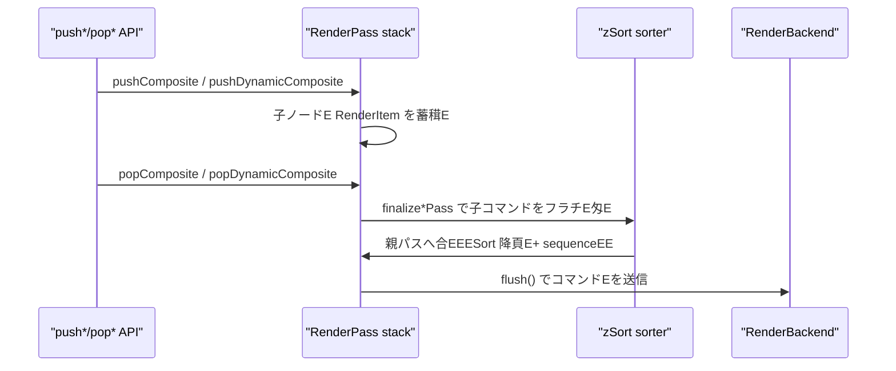
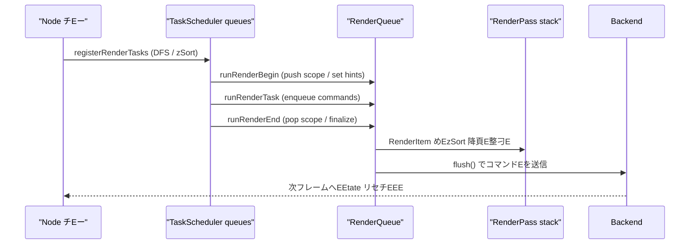

# 新レンダリングパイプライン現行仕様！EaskScheduler / RenderQueueEE

本ドキュメントE 2025-03 時点でリポジトリに実裁Eみの描画パイプラインを整琁Eる、E 
一部まだ WIP の挙動はあるが、ここでは「現状こう動いてぁE」とぁE事実Eースの惁Eをまとめ、E
TaskScheduler・RenderQueue・Node チEーの関連を可視化する、E

---

## 1. 全体像

- `Puppet.update()` ぁE1 フレームを駁Eし、TaskScheduler に Node チEー全体E処琁E登録、E
- TaskScheduler は `TaskOrder` の固定シーケンスで吁Eスクを実行し、RenderQueue へ GPU コマンドを積E、E
- RenderQueue は Root / Composite / DynamicComposite ごとに `RenderPass` を積み上げ、E 
  同じターゲチEへ出力するコマンドを `zSort` 降頁E+ 受付頁E安定ソートしてから Backend へ渡す、E
- Composite / DynamicComposite は `push*/pop*` でスコープを宣言し、子ノードE描画結果めE
  自身の FBO に閉じ込めた後で親ターゲチEへ転送する。EスクめEDynamicComposite の再描画判定もここで完結する、E

---

## 2. TaskScheduler

### 2.1 チEEタ構造

- 実裁E `source/nijilive/core/render/scheduler.d`
- `TaskScheduler` は `Task[][TaskOrder] queues` を保持し、E 
  `orderSequence = [Init, Parameters, PreProcess, Dynamic, Post0, Post1, Post2, RenderBegin, Render, RenderEnd, Final]`
  の固定頁Eループする、E
- `Task` は `(TaskOrder order, TaskKind kind, TaskHandler handler)` のタプルで、`TaskHandler` は
  `void delegate(ref RenderContext)`。`RenderContext` には `RenderQueue* renderQueue` と
  `RenderBackend renderBackend`, `RenderGpuState gpuState` がEる、E

### 2.2 ノEド登録フロー

- 吁E`Node` は `registerRenderTasks` を持ち、E身と子ノードEタスクめEDFS で登録する、E
  - 子ノード一覧は褁E後に **`zSort` 降頁E stable sort** され、TaskOrder に関わらず奥→手前で登録される、E
  - 吁ENode はチEォルトで InitEFinal までのタスクめE1 つずつ積E。`Composite` めE`DynamicComposite` は
    スコープ管琁EEために RenderBegin/Render/RenderEnd の登録方法を上書きする、E
  - `DynamicComposite` が祖Eに存在するサブツリーはオフスクリーン再利用のため、E
    自身の Render フェーズをスキチEEし、親 DynamicComposite から委譲されたタスクのみを持つ、E
- `Puppet.update()` は
  1. `renderQueue.beginFrame()` と `renderScheduler.clearTasks()`
  2. ルーチENode の `registerRenderTasks`
  3. `TaskOrder.Parameters` にパラメータEEDriver 更新をまとめたタスクを追加\
     EEransform dirty フラグめEE動運転の更新はここで行われるEE
  4. `renderScheduler.execute(renderContext)`
  とぁE手頁E 1 フレームを確定させる、E

### 2.3 実行時のスチEチE

1. **Init**: `runBeginTask` で Node のスチEEトを初期化し、オフセチEめEャチEュをリセチE、E
2. **Parameters**: Puppet 側で一括登録したタスクがパラメータEドライバを更新、E
3. **PreProcess / Dynamic / Post0-2**: 吁ENode が幾何計算やスチEEトE移を実施、E
4. **RenderBegin / Render / RenderEnd**: Composite / DynamicComposite はここで RenderQueue の push/pop を呼び、E
   Part は `enqueueRenderCommands` 経由で Draw コマンドを追加する、E
5. **Final**: `runFinalTask` で通知フラグ等を後E琁E、次フレームへ状態を持ち越す、E

### 2.4 DFS に沿った登録頁EE具体侁E

- `registerRenderTasks` は **親 ↁE孁E* の頁E `TaskOrder.InitEFinal` までを追加し、最後に `TaskOrder.RenderEnd` を追加する、E 
  こEため `RenderEnd` だけが **孁EↁE親**EEストオーダーEになる、E
- 子リストE `zSort` 降頁Eソート済みなので、TaskQueue 冁EE頁Eも奥→手前で安定する、E
- `DynamicComposite` 直下EノEドE `allowRenderTasks=false` の場合、`RenderBegin/Render/RenderEnd` をE刁Eは登録しなぁEE

| TaskOrder          | 親子頁E| 備老E|
|--------------------|--------|------|
| Init / PreProcess / Dynamic / Post0-2 / RenderBegin / Render / Final | 親→子（EリオーダーEE| 親のタスクがEに並び、続けて zSort 降頁EE子タスクが登録されめE|
| RenderEnd          | 子E親EEストオーダーEE| 親は自刁E子E `registerRenderTasks` が終わった後に登録する |

例として Root ↁEComposite ↁEPartA/B のチEーを老Eると、キュー冁EE並びは以下になる、E

- `TaskQueue[Render] = [Root, Composite, PartB, PartA]` EEomposite が子を zSort 降頁EB→Aで登録EE
- `TaskQueue[RenderEnd] = [PartA, PartB, Composite, Root]` E子E RenderEnd がEに来る！E

こE頁EがそEまま `TaskScheduler.execute` のループで消化され、各タスクぁE`RenderContext` を介して RenderQueue に作用する、E

---

## 3. RenderQueue

### 3.1 レイヤー別 RenderPass

- 実裁E `source/nijilive/core/render/queue.d`
- `RenderQueue` は `passStack` を保持し、`RenderPassKind` は `Root / Composite / DynamicComposite`、E
- 吁Epass には `RenderItem[] items`EEzSort`, `sequence`, `RenderCommandData[] commands`Eが蓁Eされる、E 
  `sequence` は pass 冁E単調増加し、`zSort` が同じ場合に安定頁Eを保証する、E
- `RenderScopeHint` は enqueue 先E pass を決めるヒント、Eode は祖Eを遡ってアクチEブな
  Composite / DynamicComposite を探し、該彁Epass があれEそE参Eを使ぁEEynamicComposite ぁE
  キャチEュをE利用する場合E `skipHint` を返して描画をスキチEEする、E

### 3.2 コマンド投入とソーチE

- `enqueueItem(float zSort, RenderScopeHint hint, builder)` が呼ばれると、`builder` ぁE
  `RenderCommandBuffer` にコマンドを詰め、その配EめEhint 先E pass に `RenderItem` として追加する、E
- `collectPassCommands` は吁Epass の `items` めE`zSort` 降頁EↁE`sequence` 昁EEソートし、E
  フラチEな `RenderCommandData[]` に展開する、E

### 3.3 Composite スコーチE

- `pushComposite(Composite comp, bool maskUsesStencil, MaskApplyPacket[] maskPackets)`
  が新しい pass をスタチEに積み、`popComposite(token, comp)` が対応すめEpass を終亁Eせる、E
- `finalizeCompositePass` の処琁E
  1. 子パスのコマンドを収集、E
  2. `BeginComposite ↁE子コマンチEↁEEndComposite` でラチEE、E
  3. マスクが指定されてぁEば `BeginMask / ApplyMask* / BeginMaskContent` を挿入し、E
     Composite のクワチE描画を囲ぁEE
  4. 親 pass に `DrawCompositeQuad` めEenqueue し、Composite 側へ scope close を通知、E
- 親 pass の決定には `parentPassIndexForComposite` を用ぁE Node チEー上E親 Composite / DynamicComposite を探索する、E

### 3.4 DynamicComposite スコーチE

- `DynamicComposite` は `dynamicRenderBegin` で再描画が忁Eかを判定し、忁Eな場合Eみ
  `pushDynamicComposite` ↁE孁EPart めEoffscreen matrix に差し替えて enqueue する、E
- `dynamicRenderEnd` では
  - `popDynamicComposite(token, this, postCommands)` を呼び、`BeginDynamicComposite` EE`EndDynamicComposite` を親 pass に差し込む、E
  - `postCommands` でマスク処琁E Part としての最終描画を追加するEEmakeDrawPartCommand` などE、E
  - 再描画しなかった場合E既存テクスチャを使っぁE`enqueueRenderCommands` のみめERoot pass に積E、E
- スコープを閉じた後E `dynamicScopeActive` めE`dynamicScopeToken` をリセチEし、E
  再描画済みであればチEスチャの invalidate フラグめEdeferred カウンタを更新する、E

### 3.5 flush と Backend 連携

- `flush(RenderBackend backend, ref RenderGpuState state)` は
  1. `passStack.length == 1`EEoot のみEを enforce し、push/pop の不整合を検E、E
  2. Root pass の `RenderItem` を平坦化、E
  3. `RenderCommandKind` ごとに backend の API (`drawPartPacket`, `beginMask`, `beginComposite`, など) を呼び出す、E
- flush 後E `clear()` ↁERoot pass 再生成し、次フレームの `beginFrame` まで状態を持たなぁEE

---

## 4. TaskScheduler と RenderQueue の連携

### 4.1 2 段階キューの関俁E

1. **タスク登録EEaskSchedulerEE*  
   - Node チEーめEDFS して `TaskQueue[Order]` にタスクめEpush。頁EE §2.4 の通り、E 
   - こE段階では GPU コマンドEまだ生Eされず、「どのタイミングでどの Node の処琁E走らせるか」とぁE予定表だけができる、E
2. **タスク実衁EↁERenderQueue 更新**  
   - `TaskScheduler.execute` が各 `TaskQueue` を消化。`RenderContext` 冁EE `renderQueue` へのポインタを通じて
     `runRenderBegin/RunRender/RunRenderEnd` が呼ばれ、忁Eに応じて `push*/pop*` / `enqueueItem` を実行する、E
   - RenderQueue 側では `passStack` にレンダーターゲチEごとの `RenderPass` が積まれ、ノードE `zSort` を保ったまま
     `RenderItem` が蓄積される、E
3. **RenderQueue flush ↁEBackend**  
   - 全 TaskOrder が終わり、`passStack` ぁERoot のみになったら `flush()` を呼ぶ、E 
   - `RenderCommandKind[]` ぁEBackend へ渡り、FBO 刁EめEEスク適用を含む宁EGPU 呼び出しが実行される、E

こEように「TaskSchedulerEロジチE頁E」E「RenderQueueE描画命令E」E「BackendEEPUE」とぁE 3 段階を頁E通過する、E

### 4.2 スチEプE解

1. **チEー探索と準備**  
   `scanParts` がドライバEPart を収雁E、Composite / DynamicComposite は孁EPart のローカル並び替えや
   offscreen 変換行Eを準備する、E
2. **TaskScheduler への投E**  
   `registerRenderTasks` ぁE`zSort` 降頁Eタスクを登録。`RenderEnd` だけがポストオーダーになるため、E
   Composite の pop 処琁E確実に子E後に実行される、E
3. **TaskOrder ごとの実衁E*  
   `TaskScheduler.execute` ぁEorderSequence を回り、`runBeginTask ↁE... ↁErunFinalTask` が呼ばれる、E
   Render フェーズでは `RenderScopeHint` を計算し、該当スコープE RenderPass にコマンドを追加する、E
4. **RenderQueue のスタチE処琁E*  
   `pushComposite/pushDynamicComposite` ぁEpassStack にスコープを積み、子ノードE `enqueueItem`
   はそEスコープに `RenderItem` を増やす。`pop*` で `finalize*Pass` が走り、子コマンドが親 pass に転送される、E
5. **flush と GPU 呼び出ぁE*  
   `RenderQueue.flush()` ぁERoot pass の `RenderItem` をフラチE化し、Backend に対して
   `RenderCommandKind` の頁E呼び出す。完亁EE`clear()` して次フレームの `beginFrame()` に備える、E

---

## 5. 設計指針（現行コードが依存してぁE前提EE

- **スコープ整合性の拁EE*: すべての `push*` は忁E `pop*` とペアで呼ばれ、E
  flush 前に `passStack.length == 1` であることめEenforce してぁE、E
- **zSort の一貫性**: Task 登録時と RenderQueue 冁Eの両方で `zSort` 降頁E徹底し、E
  DFS の親子関係を壊さずに「奥→手前」E描画頁E維持する、E
- **マスクの局所匁E*: `MaskApplyPacket` の適用は Composite / DynamicComposite の転送時に限定し、E
  子ノードE描画冁Eへ直接干渉しなぁEE
- **DynamicComposite の再描画最小化**: `reuseCachedTextureThisFrame` / `textureInvalidated`
  などのフラグでオフスクリーン再描画を抑制し、不要な push/pop めEDrawCommand を避ける、E
- **Backend への依存最小化**: RenderQueue からは `RenderCommandKind` の列だけを渡し、E
  OpenGL など具体的な実裁E細は Backend に閉じ込める、E

以上により、現行実裁EE TaskScheduler と RenderQueue の挙動を俯瞰できるようになった、E

---

## 6. RenderBackend と RenderGpuState

### 6.1 RenderBackend インターフェース

- 定義場所: `source/nijilive/core/render/backends/package.d`
- `RenderBackend` は RenderQueue から渡されめE`RenderCommandKind` を最終的な GPU 呼び出しへ変換する抽象層、E
- 主なメソチE群:

| 刁EE| 代表メソチE | 説昁E|
|------|--------------|------|
| 初期匁E/ ビューポEチE| `initializeRenderer`, `resizeViewportTargets`, `beginScene`, `endScene`, `postProcessScene` | レンダラのセチEアチEEとフレーム墁E処琁E|
| Drawable/Part リソース | `initializeDrawableResources`, `createDrawableBuffers`, `uploadDrawableIndices`, `uploadSharedVertexBuffer`, `uploadSharedUvBuffer`, `uploadSharedDeformBuffer`, `drawDrawableElements` | メチEュめE点バッファの生E・更新 |
| ブレンチE/ チEチE | `supportsAdvancedBlend`, `setAdvancedBlendEquation`, `issueBlendBarrier`, `initDebugRenderer`, `drawDebugLines` | 高度なブレンドモードやチEチE描画制御 |
| RenderQueue 由来の描画 | `drawPartPacket`, `drawMaskPacket`, `beginComposite`, `drawCompositeQuad`, `endComposite`, `beginMask`, `applyMask`, `beginMaskContent`, `endMask` | RenderCommandKind と 1:1 に近いメソチE群 |
| DynamicComposite | `beginDynamicComposite`, `endDynamicComposite`, `destroyDynamicComposite` | 動的オフスクリーン用 FBO 管琁E|
| 補助描画 | `drawTextureAtPart`, `drawTextureAtPosition`, `drawTextureAtRect` | UI めEバッグ向けの直接描画 API |
| フレームバッファ・チEスチャ取征E| `framebufferHandle`, `renderImageHandle`, `compositeFramebufferHandle`, ... | 外部チEEルめEEストEロセスが現在の GPU リソースを参照するためのハンドル群 |
| 差刁E測 | `setDifferenceAggregationEnabled`, `evaluateDifferenceAggregation`, `fetchDifferenceAggregationResult` | DifferenceAggregation を用ぁE自動テスチE検証向け機E |

- RenderQueue から見ると **flush 時にこれらEメソチEを頁Eに呼ぶだぁE*であり、OpenGL など具体的な実裁EE Backend 側が担ぁEE

### 6.2 RenderGpuState

- 構造佁E `RenderGpuState { uint framebuffer; uint[8] drawBuffers; ubyte drawBufferCount; bool[4] colorMask; bool blendEnabled; }`
- 役割:
  - Backend が現在バインドしてぁE FBO めEラーマスク、ブレンド状態をキャチEュする、E
  - `RenderQueue.flush()` 開始時に `state = RenderGpuState.init;` としてクリアし、Backend が忁Eに応じて上書きする、E
  - 封E皁E褁E Backend 実裁EEpenGL / Vulkan 等）が共通インターフェースで状態を共有できるようにするための足場、E

これにより、ドキュメント上でめERenderQueue ↁERenderBackend の役割刁Eと、状態管琁EE流れを追ぁEとができる、E

---

## 7. フレーム間E利用レイヤーEE025-11 追記！E

> **Status:** ブランチE`refactor/rendering-soa2` にて実裁Eみ、E 
> **目皁E** TaskScheduler / RenderQueue の処琁EE DFS の特性を維持したまま、同一冁Eのフレームで不要な再構築やメモリアロケーションを省くこと、E

ここまでのセクションで説明したタスク登録ERenderQueue スコープE流れは従来通りである。E利用レイヤーは「どのフレームでそれを実行する忁Eがあるか」を決めてぁEに過ぎなぁEE

### 7.1 NotifyReason による変化トラチEング

- すべての `Node.notifyChange` は親へ伝搬する前に忁E所属すめE`Puppet` を呼び出し、`NotifyReason` を記録させる、E
- Puppet 側では 1 フレームにつぁE2 つのフラグを持つ:
  - `structureDirty`: チEー構造めEEスク構Eが変わった場合、またE `forceFullRebuild` が指定された場合に立つ、E
  - `attributeDirty`: パラメータ値・ドライバE力ETransform など属性の変化で立つEEStructureChanged` でも同時に立つE、E
- `Puppet.update()` はフレーム冒頭で `consumeFrameChanges()` を呼び、フラグを読み出してからリセチEする、E

### 7.2 TaskScheduler キャチEュ

- 初回フレーム、またE `structureDirty` が立ってぁEフレームだぁE`rebuildRenderTasks()` を実行する、E
  1. TaskScheduler の全キューをクリア、E
  2. `rootNode.registerRenderTasks` を従来と同じ手頁E呼ぶ、E
  3. Puppet 側で `TaskOrder.Parameters` に `updateParametersAndDrivers` を呼ぶチEゲートを差し込む、E
- 構造が変わってぁEぁE合E TaskScheduler をE登録せず、前フレームのキュー冁Eをそのまま再利用できる、E

### 7.3 Init + Parameters スチEEジの常時実衁E

- フレームをE構築するかどぁEに関わらず、毎フレーム `renderScheduler.executeRange(ctx, TaskOrder.Init, TaskOrder.Parameters)` めE1 回実行する、E
- これにより `runBeginTask`E変形スタチEめEィルタ状態EリセチEEが忁Eパラメータ更新より先に走る。従来の「Init ↁEParameters ↁE…」頁Eを崩さずに再利用を行える、E
- こEスチEEジの実行中に構造変化が発生した場合E即座に `structureDirty` が立つため、後段で再登録される、E

### 7.4 RenderGraph / RenderQueue のコマンドE利用

- `renderGraph.takeCommands()` で得た Root pass の `RenderCommandData[]` めE`cachedCommands` として保持し、`cachedCommandsValid` ぁEtrue の間E再利用を許す、E
- Init+Parameters 後に `structureDirty` めE`attributeDirty` も立ってぁEければ、`TaskOrder.PreProcess` 以降E実行をスキチEEし、`renderQueue.setBuffer(cachedCommandBuffer, false)` で前回のコマンドEを流用する、E
- ぁEれかのフラグが立ってぁE場合E通常どおり残りの TaskOrder を実行し、`renderGraph.beginFrame()` ↁE`takeCommands()` の結果を新しい `cachedCommands` として保存する、E

### 7.5 1 フレームの処琁EローEE利用時！E

1. `forceFullRebuild` またE `structureDirty` なめETaskScheduler をE登録、E
2. 忁E Init + Parameters 頁E実行（変形スタチEをリセチE ↁEパラメータEドライバを適用E、E
3. こE時点で構造変化が検Eされたらもう一度 1 に戻って再登録、E
4. Attribute めEStructure も変化してぁEければ render フェーズをスキチEEし、キャチEュ済みコマンドを RenderQueue に積んでフラチEュする、E
5. 変化があれE render フェーズを実行し、新しいコマンドEをキャチEュする、E

---

## 8. Struct-of-Arrays ベEスの共有ジオメトリアトラス

以前E Part / Deformable ごとに個別の VBO をアチEEロードしてぁEが、現在は `Vec*Array` を利用した共有アトラスへ移行し、E フレームにつき頂点EUVE変形バッファをそれぞめE1 回だけアチEEロードしてぁE、E

### 8.1 Vec*Array の概要E

- `nijilive.math.veca` で定義されめE`Vec2Array` / `Vec3Array` / `Vec4Array` は成Eごとに連続したレーンを持つ Struct-of-Arrays 形式Eバッファ、E
- `lane(0)`, `lane(1)` などで吁EE刁Eのポインタを取得でき、E速なバルクコピEめESIMD 最適化がしやすい、E
- `bindExternalStorage(storage, offset, length)` により、既存E `Vec*Array` を別の連続メモリEE有アトラスEへ再バインドできる、E

### 8.2 SharedVecAtlas と登録処琁E

- `nijilive.core.render.shared_deform_buffer` には `deformAtlas`, `vertexAtlas`, `uvAtlas` の 3 つの `SharedVecAtlas` がある、E
- それぞれぁE`Vec2Array*` とドローコマンド用のオフセチE書き込み先を記録し、以下Eライフサイクルで動作すめE
  1. `Drawable` のコンストラクタで `sharedDeformRegister` / `sharedVertexRegister` / `sharedUvRegister` を呼び、各 `Vec2Array` とオフセチE格納Eポインタを渡す、E
  2. アトラスは登録済み配Eの合計長を計算し、忁Eなサイズの新しい `Vec2Array` を確保して lane 単位でコピEする、E
  3. 吁EードE `Vec2Array` には `bindExternalStorage` で共有メモリをEバインドし、描画パケチEに書き込むスライスオフセチEも更新する、E
- 配E長が変わった場合E `shared*Resize` がE配置をトリガーし、破棁Eには `shared*Unregister` で登録解除する、E

### 8.3 PartDrawPacket への反映

- `RenderCommandData.partPacket` には `vertexOffset`, `vertexAtlasStride`, `uvOffset`, `uvAtlasStride`, `deformOffset`, `deformAtlasStride` が含まれ、E有アトラス冁EE位置を示す、E
- Drawable はアトラスが書き戻した `vertexSliceOffset` などの値をそのままパケチEに設定するだけでよく、アトラスがE構築されなぁEりE計算E不要、E

### 8.4 RenderQueue.flush でのアチEEローチE

- `RenderQueue.flush` 冒頭で `sharedVertexBufferDirty()` などを確認し、dirty なアトラスだけをまとめてアチEEロードする、E
- Backend (OpenGL 実裁Eど) は属性ごとに 1 つの GL バッファを持ち、`glUploadFloatVecArray(sharedBuffer, atlasData, ...)` めE1 回呼ぶだけで全 Drawable の頂点めEUV を更新できる、E
- 共有アトラスなので flush 中にバインドや `glBufferData` を繰り返す忁Eがなく、`DrawPartPacket` ごとに VBO をEり替えるコストが消える、E

### 8.5 ダーチEフラグとの連携

- Drawable ぁE`Vec2Array` の冁Eを直接書き換えた場合（物琁Eミュレーション、ウェルド、メチEュ編雁EどEE `shared*MarkDirty()` を呼ぶだけでよい。長さが変わらなぁEりアトラスの再E置は不要、E
- セクション 7 のフレーム再利用と絁E合わせると、ジオメトリめEGPU コマンドも変化がなぁEレームでは一刁EEアチEEロードを行わなぁE済E、E

---

## 9. フレーム間E利用レイヤーE詳細版！E

高レベルの老E方は §7 にまとめたが、実裁EE細部をもぁEし噛み砕いて整琁Eておく、E

### 9.1 変化検Eの基本

- `Node.notifyChange` ↁE`Puppet.recordNodeChange(reason)` の頁E呼ばれ、`structureDirty` / `attributeDirty` の 2 ビットに刁Eされる、E
- `StructureChanged` は両方のビットを立て、それ以外！EAttributeChanged`, `Transformed`, `Initialized`EE `attributeDirty` のみを立てる、E
- `consumeFrameChanges()` がフラグを読み出してクリアする唯一の場所で、以降E処琁EEこE返り値だけを見て再利用可否を判断する、E

### 9.2 TaskScheduler の再利用条件

- `forceFullRebuild` / `structureDirty` / `schedulerCacheValid == false` のぁEれかの場合Eみ `rebuildRenderTasks()` を実行する、E
- 再登録後E `schedulerCacheValid = true` となり、構造が変わらなぁEり次のフレームもそのまま使われる、E

### 9.3 Init + Parameters の強制実衁E

- `renderScheduler.executeRange(ctx, TaskOrder.Init, TaskOrder.Parameters)` をフレームごとに忁E呼び、`runBeginTask` と `updateParametersAndDrivers` をセチEで動かす、E
- ここで構造変更が起きた場合E `structureDirty` がEび立つため、続く処琁E即座に再登録が走る、E

### 9.4 Render フェーズとコマンドキャチEュ

- `cachedCommandsValid` ぁEtrue で、かつ `attributeDirty` めE`structureDirty` めEfalse の場合E Render フェーズEEreProcess 以降）をスキチEEする、E
- どちらかのフラグぁEtrue なめERender フェーズを通常通り実行し、`renderGraph.beginFrame()` ↁE`takeCommands()` で新しい `cachedCommands` を作Eする、E

### 9.5 リビルドルーチE

1. 構造変化を確認し、忁EなめETaskScheduler をE登録、E
2. Init + Parameters を実行して変形スタチEとパラメータを同期、E
3. ここで構造変化が起きためE1 に戻る、E
4. 最終的な `FrameChangeState` を基に Render フェーズを実行するかどぁE判断し、忁EならコマンドEを更新、E
5. `cachedCommandsValid` ぁEtrue なめERenderQueue にセチEし、そぁEなければ `clear()` する、E

こE詳細版を参Eすれば、変更検知 ↁEスケジューラ再利用 ↁERenderGraph 再利用の流れを実裁Eベルで追える、E
