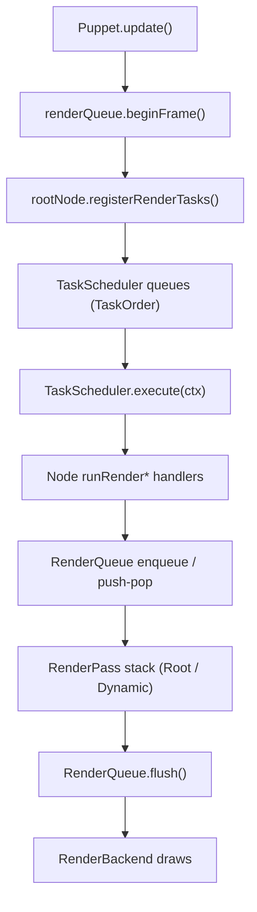
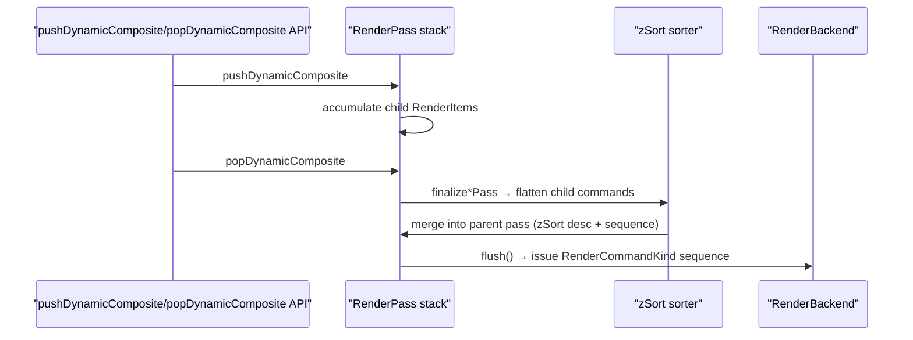

# 現行レンダリングパイプライン（TaskScheduler / RenderQueue）

このドキュメントは 2025-03 時点でリポジトリに実装済みの描画パイプラインを記録したものです。WIP な部分もありますが、「今どう動いているか」を TaskScheduler / RenderQueue / Node ツリーの関係とともにまとめます。

---

## 1. 全体フロー

- `Puppet.update()` が 1 フレームを駆動し、TaskScheduler に Node ツリー全体を登録する。
- TaskScheduler は固定の `TaskOrder` シーケンスを実行し、レンダー段階で GPU コマンドを RenderQueue に積む。
- RenderQueue は Root / DynamicComposite ごとに `RenderPass` を持ち、`zSort` 降順＋受付順で並べてから backend に渡す。
- DynamicComposite は `pushDynamicComposite/popDynamicComposite` でスコープを開閉し、子を自前の FBO に描いてから親に渡す。マスク適用や再描画要否の判定もこのスコープ内で行う。

---

## 2. TaskScheduler

### 2.1 データ構造
- 実装: `source/nijilive/core/render/scheduler.d`
- `TaskScheduler` は `Task[][TaskOrder] queues` を持ち、`orderSequence = [Init, Parameters, PreProcess, Dynamic, Post0, Post1, Post2, RenderBegin, Render, RenderEnd, Final]` を順に走査。
- `Task` は `(TaskOrder, TaskKind, TaskHandler)` のタプル。`TaskHandler` は `void delegate(ref RenderContext)` で、`RenderContext` に `RenderQueue*`, `RenderBackend`, `RenderGpuState` を含む。

### 2.2 ノード登録
- すべての `Node` が `registerRenderTasks` を実装し、DFS で自身と子を登録。
  - 子リストは複製後 **`zSort` 降順の stable sort**。背面→前面の順で登録される。
  - 各ノードは Init〜Final まで 1 タスクずつ積む。DynamicComposite は render フェーズの登録を上書きしてスコープ管理を行う。
  - DynamicComposite の子サブツリーはオフスクリーン再利用のため `allowRenderTasks=false` なら Render フェーズをスキップ。
- `Puppet.update()` の流れ:
  1. `renderQueue.beginFrame()` と `renderScheduler.clearTasks()`
  2. ルートノードの `registerRenderTasks`
  3. `TaskOrder.Parameters` にパラメータ／ドライバ更新タスクを追加
  4. `renderScheduler.execute(renderContext)`

### 2.3 実行ステージ
1. **Init**: `runBeginTask` で状態初期化、オフセット・キャッシュをリセット。
2. **Parameters**: パラメータ／ドライバ更新。
3. **PreProcess / Dynamic / Post0-2**: 幾何計算やステート遷移。
4. **RenderBegin / Render / RenderEnd**: DynamicComposite がスコープを開閉し、Part が `enqueueRenderCommands` を呼ぶ。
5. **Final**: `runFinalTask` で通知を処理し、次フレームへ状態を引き継ぐ。

### 2.4 DFS による登録順
- `registerRenderTasks` は **親→子のプレオーダー**で Init〜Final を積み、最後に `RenderEnd` を **子→親のポストオーダー**で積む。
- 子が `zSort` 降順なので、キューも背面→前面順を保つ。
- DynamicComposite 直下で `allowRenderTasks=false` の子は `RenderBegin/Render/RenderEnd` を登録しない。

| TaskOrder | 親子順 | 備考 |
|-----------|--------|------|
| Init / PreProcess / Dynamic / Post0-2 / RenderBegin / Render / Final | 親→子 (プレオーダー) | 親が先、続いて zSort 降順の子 |
| RenderEnd | 子→親 (ポストオーダー) | 親の子登録が終わった後に積む |

---

## 3. RenderQueue

### 3.1 レイヤー別 RenderPass
- 実装: `source/nijilive/core/render/queue.d`
- `RenderQueue` は `passStack` を持ち、`RenderPassKind` は `Root / DynamicComposite`。
- 各パスは `(zSort, sequence, RenderCommandBuilder)` を持つ `RenderItem[]` を溜める。`sequence` は同一パス内で単調増加し、同 zSort の安定順を保証。
- `RenderScopeHint` は enqueue 先のパスを決める。先祖の DynamicComposite を遡って探し、キャッシュ再利用時は `skipHint` で enqueue を抑止。

### 3.2 Enqueue とソート
- `enqueueItem(zSort, hint, builder)` でビルダーを pass に登録。
- `collectPassItems` が各パスの items を `zSort` 降順→`sequence` 昇順でソートして返す。

### 3.3 DynamicComposite スコープ
- `dynamicRenderBegin`: 再描画が必要なら `pushDynamicComposite`。子のモデル行列をオフスクリーン基準に書き換え、子を enqueue（入れ子の DynamicComposite は再帰）。
- `dynamicRenderEnd`: `popDynamicComposite(token, this, postCommands)` で `BeginDynamicComposite → child → EndDynamicComposite` を挿入。`postCommands` は通常 DynamicComposite を Part として描く（マスク含む）。再描画不要なら `enqueueRenderCommands` のみ。
- 閉じた後は `dynamicScopeActive` / `dynamicScopeToken` をリセットし、`textureInvalidated` や `deferred` を更新。

### 3.5 flush と Backend
- `flush(RenderBackend backend, ref RenderGpuState state)` は Root パスのみであることを確認し、コマンドを平坦化して backend API（例: `drawPartPacket`, `beginMask`, `applyMask`）を呼ぶ。
- flush 後は `clear()` でパスを初期化し、次の `beginFrame()` に備える。

---

## 4. TaskScheduler と RenderQueue の協調

1. **Scheduling**: DFS で `TaskQueue[TaskOrder]` にハンドラを登録（順序だけ決まる）。
2. **Execution**: `TaskScheduler.execute` が各キューを実行。Render フェーズで `pushDynamicComposite/popDynamicComposite` と `enqueueItem` を呼ぶ。
3. **flush**: Root パスだけになったら `flush()` で `RenderCommandKind[]` を backend に渡し GPU 描画。

---

## 5. コードが依拠する保証
- **スコープ整合性**: すべての `push*` は `pop*` と対になる。flush で `passStack.length == 1` を強制。
- **zSort 一貫性**: タスク登録と RenderQueue ソートが共に `zSort` 降順を守り、DFS 関係を崩さず背面→前面を維持。
- **マスクの局所化**: `MaskApplyPacket` は DynamicComposite 転送時に限定し、子描画へ副作用を出さない。
- **DynamicComposite キャッシュ規律**: `reuseCachedTextureThisFrame` / `textureInvalidated` で不要な再描画とスコープ操作を抑制。
- **Backend 抽象化**: RenderQueue は `RenderCommandKind` を列挙するだけで、API 依存の処理は backend 側に隠蔽。

---

## 6. RenderBackend と RenderGpuState

### 6.1 RenderBackend インターフェース
- 定義: `source/nijilive/core/render/backends/package.d`
- RenderQueue の `RenderCommandKind` を実際の GPU 呼び出しに変換する抽象層。
- 主なグループ:

| カテゴリ | 代表的メソッド | 目的 |
|----------|----------------|------|
| 初期化/ビューポート | `initializeRenderer`, `resizeViewportTargets`, `beginScene`, `endScene`, `postProcessScene` | レンダラセットアップとフレーム境界 |
| Drawable/Part 資源 | `initializeDrawableResources`, `createDrawableBuffers`, `uploadDrawableIndices`, `uploadSharedVertexBuffer`, `uploadSharedUvBuffer`, `uploadSharedDeformBuffer`, `drawDrawableElements` | メッシュ/頂点バッファの確保と更新 |
| ブレンド/デバッグ | `supportsAdvancedBlend`, `setAdvancedBlendEquation`, `issueBlendBarrier`, `initDebugRenderer`, `drawDebugLines` | ブレンド方程式とデバッグ描画 |
| RenderQueue 由来描画 | `drawPartPacket`, `beginMask`, `applyMask`, `beginMaskContent`, `endMask` | RenderCommandKind → backend API |
| DynamicComposite | `beginDynamicComposite`, `endDynamicComposite`, `destroyDynamicComposite` | 動的オフスクリーンのライフサイクル |
| ユーティリティ描画 | `drawTextureAtPart`, `drawTextureAtPosition`, `drawTextureAtRect` | UI/デバッグ向け直接描画 |
| FB/テクスチャハンドル | `framebufferHandle`, `renderImageHandle`, `compositeFramebufferHandle`, ... | 外部ツール/ポストプロセス向けアクセス |
| 差分集計 | `setDifferenceAggregationEnabled`, `evaluateDifferenceAggregation`, `fetchDifferenceAggregationResult` | 自動ビジュアル差分ツール用 |

### 6.2 RenderGpuState
- 構造体: `RenderGpuState { uint framebuffer; uint[8] drawBuffers; ubyte drawBufferCount; bool[4] colorMask; bool blendEnabled; }`
- 役割:
  - バインド中の framebuffer / drawBuffers / colorMask / blend 状態のキャッシュ。
  - `flush()` 前に `state = RenderGpuState.init;` でリセットし、backend が GPU 状態を更新。
  - API 非依存の共有ステートとして OpenGL 以外の backend でも再利用可能。

---

## 7. フレーム再利用レイヤー（概要）
- 位置づけ: DFS / TaskScheduler / RenderQueue の順序はそのままに、ノード変更がないフレームで再構築を避ける仕組み。
- 変更検出: `Node.notifyChange` が Puppet に `structureDirty` / `attributeDirty` を蓄積。`consumeFrameChanges()` で読み出しクリア。
- TaskScheduler キャッシュ: `structureDirty` または `forceFullRebuild` 時のみ `rebuildRenderTasks()` で DFS 登録。そうでなければ前回キューを再利用。
- Init+Parameters の保証: 構造を再利用する場合でも毎フレーム `executeRange(Init..Parameters)` を必ず実行し、変形スタックを初期化した上でパラメータを反映。
- RenderGraph/Queue: 毎フレーム `renderGraph.beginFrame()` を呼び、ビルダーを再生（キャッシュしたコマンドバッファは持たない）。Init+Parameters 中に構造変化があれば即座に再登録。

---

## 8. SoA 共有ジオメトリアトラス（Vec*Array + shared buffers）
- 以前は Part ごとに VBO をアップロードしていたが、現在は `Vec*Array` ベースの共有アトラスに集約。
- 仕組み:
  - `sharedDeformRegister` / `sharedVertexRegister` / `sharedUvRegister` が各 Drawable の `Vec2Array` をアトラスに登録し、`*SliceOffset` にオフセットを書き戻す。
  - アトラスが単一の連続メモリを再構築し、`bindExternalStorage` で各 VecArray を共有バッファにひも付け。
  - Dirty フラグで GPU への再アップロードを制御（長さ変更時のみ再構築）。
- `PartDrawPacket` は `vertexOffset` / `uvOffset` / `deformOffset` と各 stride を保持し、共有アトラス上の位置を指す。
- `RenderQueue.beginFrame` で dirty な共有バッファだけを一括アップロードし、その後の描画では同じ VBO を使い回す。

---

## 9. フレーム間再利用の詳細
1. 必要ならキュー再構築（`structureDirty` / `forceFullRebuild`）。
2. 毎フレーム Init + Parameters を実行（変形リセット＋パラメータ反映）。
3. Init+Parameters で構造変化があれば再構築をやり直す。
4. 残りの TaskOrder を実行し RenderGraph を組み立てる。
5. `renderGraph.playback(commandEmitter)` でビルダーを即時再生し、backend が GPU 仕事に変換。

これでノードが変わらないフレームでは無駄な再構築とアップロードを避けつつ、元の順序とスコープ規則を保ったまま描画できる。
