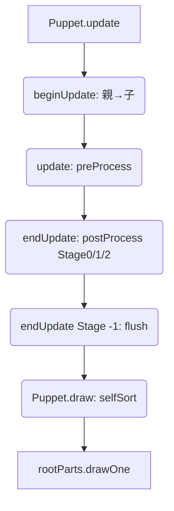

# 現行レンダリングパイプライン（beginUpdate → update → endUpdate）

nijilive の描画は、従来どおりノードツリーを親→子へ再帰しながら `beginUpdate` → `update` → `endUpdate` を回す方式で実装されている。TaskQueue / RenderQueue の導入は計画中であり、実際の描画はすべて `Node.drawOne()` が直接 OpenGL を呼ぶ構造のままになっている。本ドキュメントでは現行挙動を正しく把握するため、旧来フローを詳述する。

## フレーム処理の流れ

1. **`Puppet.update()`**
   - ルートノード (`actualRoot`) に対して `beginUpdate()` を呼び、以下を初期化する。
     - `preProcessed`、`postProcessed` といった一時フラグ
     - `offsetTransform`／`overrideTransformMatrix`
   - パラメータ／ドライバを更新した後、`actualRoot.transformChanged()` で行列を汚す。
   - `actualRoot.update()` が `preProcess()` を呼んでから子ノードへ `update()` を再帰し、`translateChildren` やデフォーマ適用をここで行う。
   - `actualRoot.endUpdate(id)` を `id = 0, 1, 2, -1` の順に呼び、Stage 0/1/2 の `postProcess()` を経て最後に `flushNotifyChange()` を実行する。

2. **`Puppet.draw()`**  
   - `selfSort()` で `rootParts` を Z ソートし、`rootPart.drawOne()` を親→子の順でそのまま呼ぶ。  
   - Composite や Mask, MeshGroup なども各 `drawOne()` 内で OpenGL を直接呼び出し、Stencil/FBO 切り替え等の特殊処理を自前で行う。

## Node のライフサイクル

| フェーズ        | 代表メソッド                          | 主な役割                                         |
|-----------------|---------------------------------------|--------------------------------------------------|
| 初期化           | `Node.beginUpdate()`                  | フラグ初期化、`offsetTransform` リセット               |
| 前処理 (CPU)    | `Node.update()`→`preProcess()`        | `translateChildren`、`deformStack.update()` 等        |
| 後処理 (CPU)    | `Node.endUpdate(id)`→`postProcess()` | Stage 0/1/2 の後処理、`postProcess(-1)` で通知 flush |

- `Deformable` は `beginUpdate()` で `deformStack.preUpdate()`、`update()` で `deformStack.update()` を呼び、最後に `updateDeform()` で頂点配列を補正する。
- `Composite` / `MeshGroup` なども同じライフサイクル上で `preProcessFilters` を登録し、派生クラス特有の処理を差し込んでいる。

## 描画 (`drawOne`) の実態

- `Part.drawOne()` は Stencil マスク処理や `glBindBuffer` を直接呼び、マスクが無ければ `drawSelf()` でテクスチャ付きポリゴンを描画する。
- `Composite.drawOne()` は内部 FBO へ描画した後、マスクがあれば `inBeginMask` / `inBeginMaskContent` / `inEndMask` の順で描画結果をブレンドする。
- `MeshGroup`／`GridDeformer`／`PathDeformer` などは子ノードに `preProcessFilters` を仕込み、`preProcess()` 中に変形を適用した後、各 `drawOne()` で結果を描画している。

## まとめ

- 現状は「CPU 側で親→子へ再帰する旧方式」が唯一の正しい実装であり、`doc/new_rendering.md` に記載された TaskQueue/RenderQueue 方式は今後の移行計画にすぎない。
- そのため開発時は `beginUpdate → update → endUpdate → draw` の順序を前提に調査・修正すること。新方式を導入する際は、このドキュメントを差し替える前に実装を完了させる必要がある。
